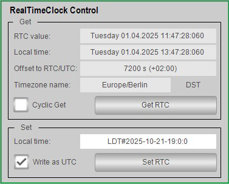

# Overview

## Graphical Representation

## Description

The function template RealTimeClock Control provides a ready-to-use coding template to control the real time clock (RTC) of the controller in your application. It implements the following features:

* Get the RTC of the controller.
* Get the local time of the controller.
* Get information about the time zone.
* Set the RTC of a controller.

NOTE: Setting information about the time zone is controller-specific. For further information, refer to the Programming Guide of your controller.

## Compatibility

The described function template can be used in applications of the controller families supported by EcoStruxure Machine Expert.

EIO0000002835.04