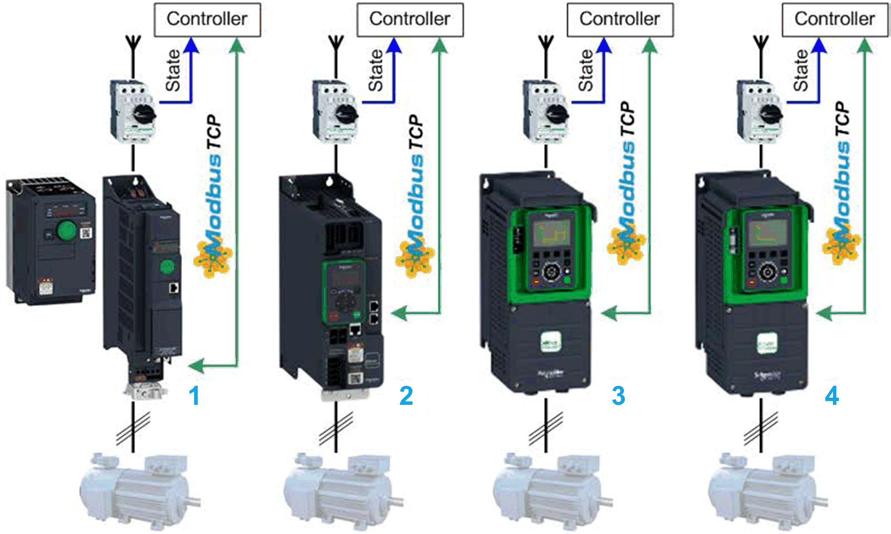

# Overview

## Graphical Representation

**1** Altivar 320 - Compact and Book format

**2** Altivar 340

**3** Altivar 6••

**4** Altivar 9••

## Device Module Description

Each Device Module covered by this description provides the application objects and the device which are required to monitor and control the associated Altivar type via Modbus TCP with a Schneider Electric controller. Each device (Altivar) requires the **Industrial Ethernet manager** under the Ethernet interface of the controller within the Devices tree of the Logic Builder configuration.

## Compatibility

The described Device Module can be used in applications of the controller families supported by EcoStruxure Machine Expert and supporting the Modbus TCP protocol.

EIO0000002835.04