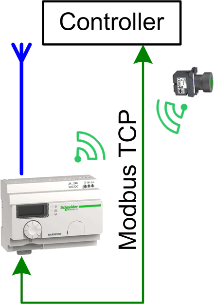

# Overview

## Graphical Representation

## Harmony\_Wireless\_ModbusTCP\_• Device Module Description

The Device Modules Harmony\_Wireless\_ModbusTCP\_• provide a ready-to-use coding template as pattern to read the signals from the Harmony ZBRN1 wireless receiver via Modbus TCP through a Schneider Electric controller.

With the Device Module Harmony\_Wireless\_ModbusTCP\_1, the communication with the wireless receiver is realized in the program code using the corresponding function block. No device is added to your application, but nevertheless the controller must provide an Ethernet interface and the Modbus TCP protocol must be supported.

With the Device Module Harmony\_Wireless\_ModbusTCP\_2, the communication with the wireless receiver is managed by the Modbus TCP IOScanner. The device Harmony ZBRN1 is added to your application; therefore the **Industrial Ethernet manager** is required under the Ethernet interface of the controller.

## Compatibility

The described Device Module can be used in applications of the controller families supported by EcoStruxure Machine Expert and supporting the Modbus TCP protocol.

EIO0000002835.04