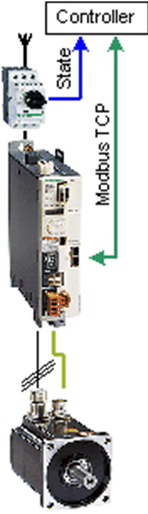

# Overview

## Graphical Representation

## Lexium\_32M\_ModbusTCP Device Module Description

The Device Module Lexium\_32M\_ModbusTCP provides the application objects and the device which are required to monitor and control a Lexium 32M via Modbus TCP with a Schneider Electric controller. The device Lexium 32M requires the **Industrial Ethernet manager** under the Ethernet interface of the controller.

## Compatibility

The described Device Module can be used in applications of the controller families supported by EcoStruxure Machine Expert and supporting the Modbus TCP protocol.

EIO0000002835.04