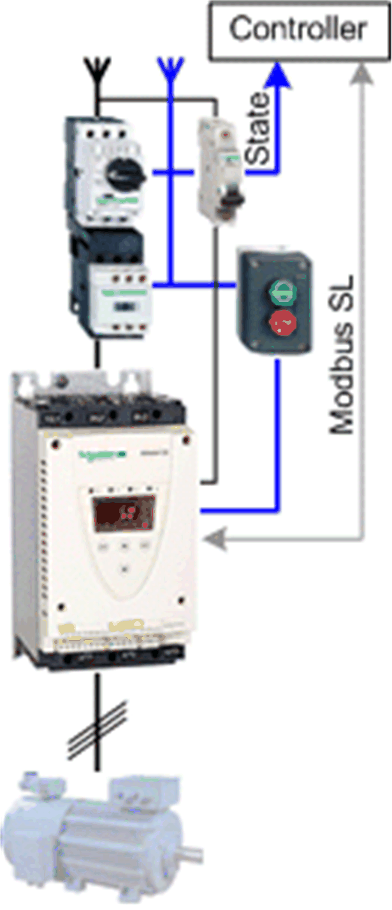

# Overview

## Graphical Representation

## ATS22\_ModbusSL Device Module Description

The Device Module provides a ready-to-use coding template as a pattern to monitor and control an Altistart 22 soft start - soft stop unit via Modbus SL through a Schneider Electric controller.

The Device Module ATS22\_ModbusSL is represented by a function template and consists of a global variable list (GVL), and a program. After instantiation of the Device Module, these objects are added to your project. They appear with the name which has been assigned using [**Add Function From Template**](../../../../../api/crossBook?lang=en-US&virtualBookName=SoMProg&topicID=D_SE_0083799).

The GVL provides the variables which are used to monitor and control a soft start - soft stop with the Altistart 22.

After instantiation, a variable `wModbusToken` is added to a global variable list with the name GVL. In the program, when the `wModbusToken` variable is equal to zero, the communication can start. When the communication starts, the used slave address is written to the variable. When the communication is finished, the value 0 is written to the variable. Use this variable to organize other Modbus SL communication function blocks in your application.

The program provides the following features:

* monitor the communication state of the device
* monitor the state of the device
* control the device in auto mode
* control the device in manual mode
* control the device in local mode

## Compatibility

The described Device Module can be used in applications of the controller families supported by EcoStruxure Machine Expert and supporting the Modbus Serial Line protocol.

EIO0000002835.04