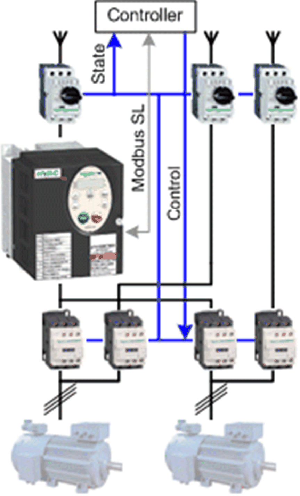

# Overview

## Graphical Representation

## ATV212\_ModbusSL\_2Motors\_Bypass Device Module Description

The Device Module provides a ready-to-use coding template as a pattern to monitor and control two motors. Each motor can be controlled either via an Altivar 212 variable speed drive, or with a direct online motor starter to bypass the drive. Only one motor can be controlled via the drive at the same time. The Altivar 212 is controlled and monitored via Modbus SL and the direct online motor starters are controlled and monitored via hardwired signals through a Schneider Electric controller.

The Device Module ATV212\_ModbusSL\_2Motors\_Bypass is represented by a function template and consists of a global variable list (GVL), and a program. After instantiation of the Device Module, these objects are added to your project. They appear with the name which has been assigned using [**Add Function From Template**](../../../../../api/crossBook?lang=en-US&virtualBookName=SoMProg&topicID=D_SE_0083799).

The GVL provides the variables which are used to monitor and control an ATV212, the switching between the motors, and the bypass control of the motors.

After instantiation, a variable `wModbusToken` is added a global variable list with the name GVL. In the program, when the `wModbusToken` variable is equal to zero, the communication can start. When the communication starts, the used slave address is written to the variable. When the communication is finished, the value 0 is written to the variable. Use this variable to organize other Modbus SL communication function blocks in your application.

The program provides the following features:

* monitor the communication state of the drive
* monitor the state of the drive and the direct online motor starters
* control both motors in auto mode
* control both motors in manual mode
* control both motors in local mode
* control both motors in bypass mode
* control one of the motors via the drive
* reset the drive in case an error state is detected

## Compatibility

The described Device Module can be used in applications of the controller families supported by EcoStruxure Machine Expert and supporting the Modbus Serial Line protocol.

EIO0000002835.04