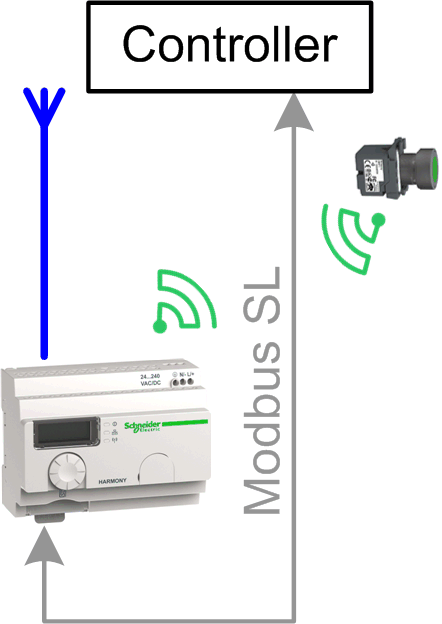

# Overview

## Graphical Representation

## Harmony\_Wireless\_ModbusSL Device Module Description

The Device Module provides a ready-to-use coding template as a pattern to read the signals from a Harmony ZBRN2 wireless receiver. Communication between the Schneider Electric controller and the receiver is via Modbus SL.

The Device Module Harmony\_Wireless\_ModbusSL is represented by a function template and consists of a global variable list (GVL), a program, and a preconfigured generic Modbus slave under the Modbus\_IOScanner. After instantiation of the Device Module, these objects are added to your project. They appear with the name which has been assigned using [**Add Function From Template**](../../../../../api/crossBook?lang=en-US&virtualBookName=SoMProg&topicID=D_SE_0083799).

The GVL provides the variables which are used to apply the wireless receiver in your application. For each channel, a variable of type BOOL is declared and mapped in the I/O mapping of the device. In the program only the monitoring of the communication is processed.

## Compatibility

The described Device Module can be used in applications of the controller families supported by EcoStruxure Machine Expert and supporting the Modbus Serial Line protocol.

EIO0000002835.04