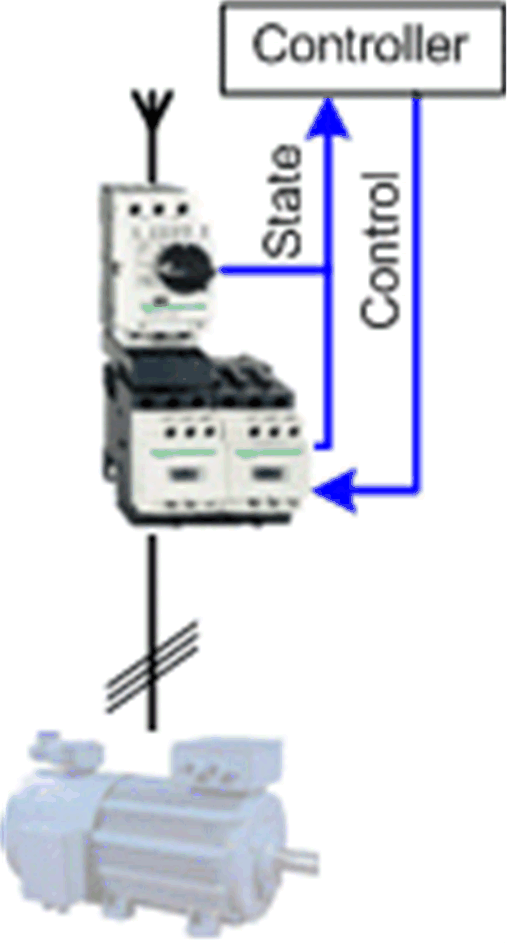

# Overview

## Graphical Representation

## Motor\_Ctrl\_2D1S Device Module Description

The Device Module provides a ready-to-use coding template as a pattern to monitor and control a hardwired direct online motor starter in two directions through a Schneider Electric controller.

The Device Module Motor\_Ctrl\_2D1S is represented by a function template and consists of a global variable list (GVL), and a program. After instantiation of the Device Module, these objects are added to your project. They appear with the name which has been assigned using [**Add Function From Template**](../../../../../api/crossBook?lang=en-US&virtualBookName=SoMProg&topicID=D_SE_0083799).

The GVL provides the variables which are used to monitor and control a motor via hardwired I/Os in 2 directions with one speed.

The program provides the following features:

* monitor the state of the motor starter
* control the motor in manual mode (latch mode)
* control the motor in local mode (latch mode)
* control the motor in auto mode (jog mode)

EIO0000002835.04