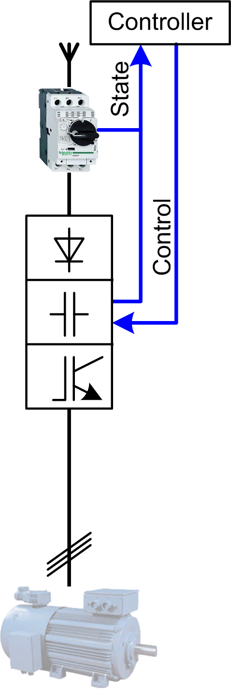

# Overview

## Graphical Representation

## VSD\_HW\_1Motor\_2DVS Device Module Description

The Device Module provides a ready-to-use coding template as a pattern to monitor and control a hardwired variable speed drive connected to one motor through a Schneider Electric controller.

The Device Module VSD\_HW\_1Motor\_2DVS is represented by a function template and consists of a global variable list GVL, and a program. After instantiation of the Device Module, these objects are added to your project. They appear with the name which has been assigned using [**Add Function From Template**](../../../../../api/crossBook?lang=en-US&virtualBookName=SoMProg&topicID=D_SE_0083799).

The GVL provides the variables which are used to monitor and control the variable speed drive via hardwired I/Os.

The program provides the following features:

* monitor the state of the device
* control the device in manual mode (latch mode)
* control the device in local mode (latch mode)
* control the device in auto mode (jog mode)

EIO0000002835.04