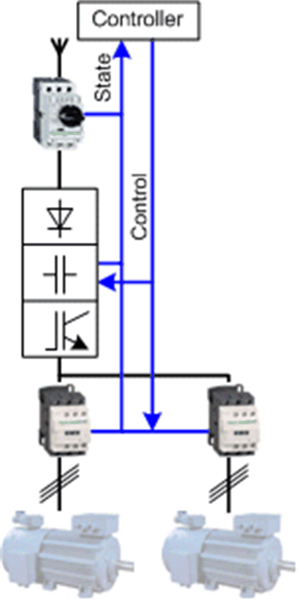

# Overview

## Graphical Representation

## VSD\_HW\_2Motors\_2D2S Device Module Description

The Device Module provides a ready-to-use coding template as a pattern for a motor control function comprised of two motors and one variable speed drive (VSD). The motor control function is realized via hardwired I/O signals. Each motor can be controlled by the VSD in forward or reverse direction with two switchable preset speeds.

The Device Module VSD\_HW\_2Motors\_2D2S is represented by a function template and consists of a global variable list (GVL), and a program. After instantiation of the Device Module, these objects are added to your project. They appear with the name which has been assigned using [**Add Function From Template**](../../../../../api/crossBook?lang=en-US&virtualBookName=SoMProg&topicID=D_SE_0083799).

The GVL provides the variables which are used to monitor and control the variable speed drive and the switching between the motors via hardwired I/O signals.

The program provides the following features:

* monitor the state of the device
* switch between the two motors
* control of one motor in manual mode (latch mode)
* control of one motor in local mode (latch mode)
* control of one motor in auto mode (jog mode)

EIO0000002835.04