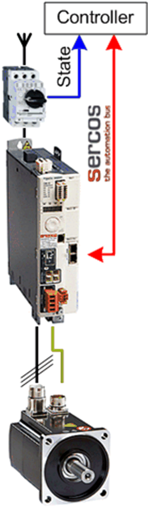

# Overview

## Graphical Representation

## Lexium\_32S\_Sercos Device Module Description

The Device Module provides the application objects and the device which are required to monitor and control a Lexium 32S via Sercos with a Schneider Electric controller.

The Device Module Lexium\_32S\_Sercos requires the Sercos Master under the corresponding Ethernet interface of the controller.

## Compatibility

The described Device Module can be used in applications of the controller family M262 supported by EcoStruxure Machine Expert and supporting the Sercos protocol.

EIO0000002835.04