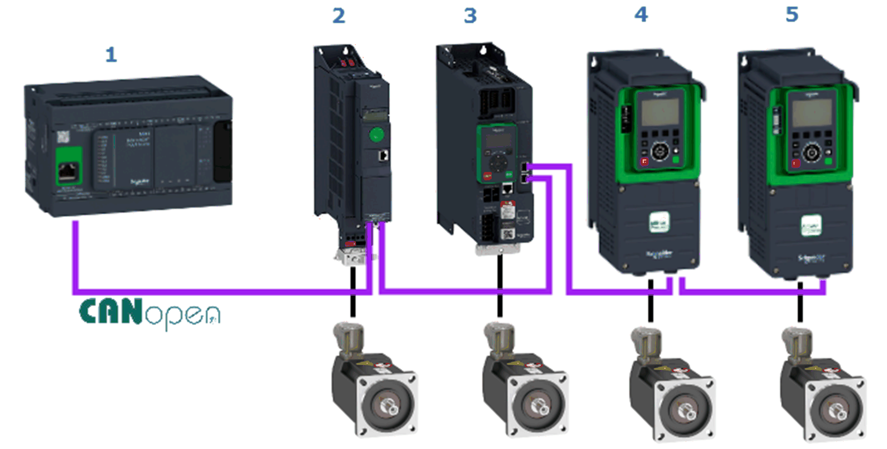

# Overview of the Hardware Configuration

Overview of the Hardware Configuration

The project example implements a Modicon M241 Logic Controller and the four different Altivar variable speed drives. The Altivar drives are linked to the controller via [CAN](../glossary/glossary.htm#XREF_D_SE_0024697_648)open fieldbus as [CANopen](../glossary/glossary.htm#XREF_D_SE_0024697_650) slaves. The controller is the CANopen master and implements the logic to control and monitor the drives over the fieldbus.

The figure presents the layout of the network:

| Item | Description |
| --- | --- |
| 1 | Modicon M241 Logic Controller |
| 2 | Altivar ATV3201) |
| 3 | Altivar ATV3401) |
| 4 | Altivar ATV6301) |
| 5 | Altivar ATV9301) |
| 1)   The Altivar drives are equipped with the communication module VW3A3608 | |