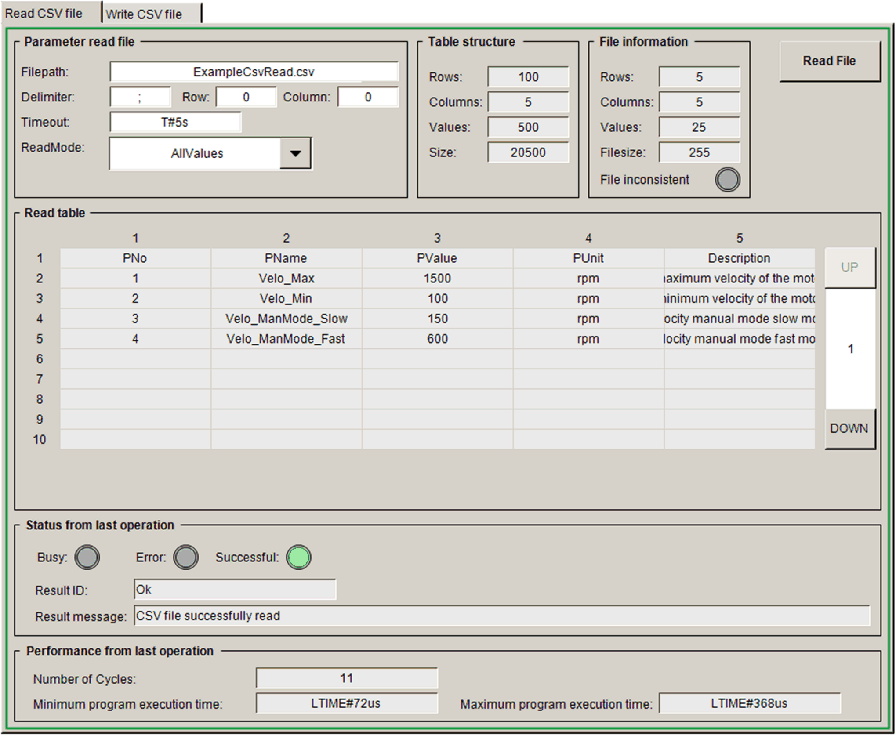
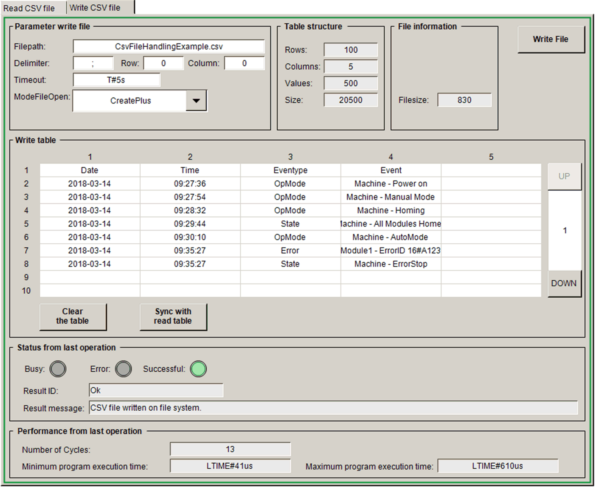

# Visualization Screens

## Overview

The application example implements a visualization in the Logic Builder within the EcoStruxure Machine Expert which can be used to control and monitor the application. Two visualization screens are provided which can be switched from the Visu\_Main.

The visualization also exists as web visualization.

With the web visualization, you have access to machine control functions over the network. To prevent unauthorized access to your machine control, perform the following technical and organizational measures for the system on which your application is running.

| WARNING | |
| --- | --- |
|  | UNAUTHENTICATED, UNAUTHORIZED ACCESS  * Do not expose controllers and controller networks to public networks and the Internet as much as possible. * Use additional security layers such as VPN for remote access and install firewall mechanisms. * Restrict access to authorized personnel by activation and deployment of the user management of the controller and the visualization. * Change default passwords at start-up and modify them frequently. * Validate the effectiveness of these measures regularly and frequently.  Failure to follow these instructions can result in death, serious injury, or equipment damage. |

## Read CSV File

Main\_Visu > Read CSV file

## Write CSV File

Main\_Visu > Write CSV file

EIO0000003413.01

© 2021

Schneider Electric.

All rights reserved.