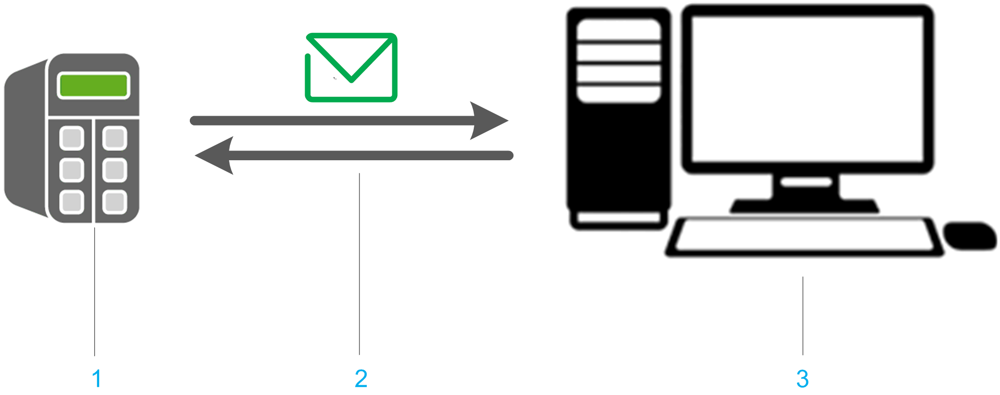

# Overview of the Hardware Configuration

## Overview

For testing purposes, a local email server has been chosen which is running on a PC in the same subnet as the controller. An additional email client is running on the same PC as the server.

**1** Controller with Email client

**2** Ethernet connection supporting protocols SMTP(S) and POP3(S)

**3** Email server

EIO0000002821.03