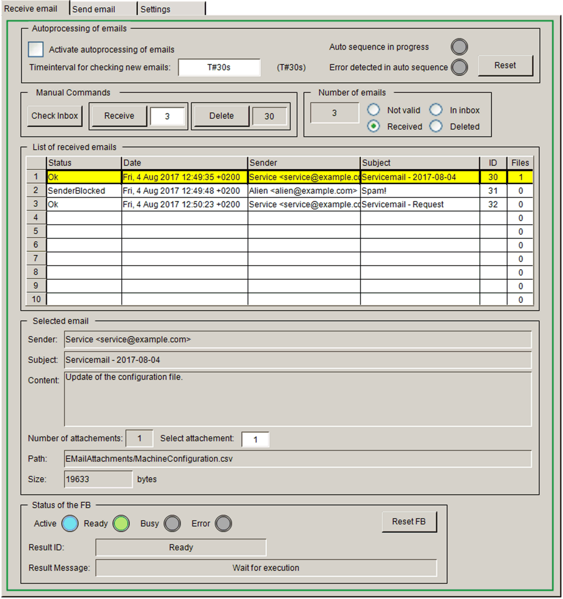
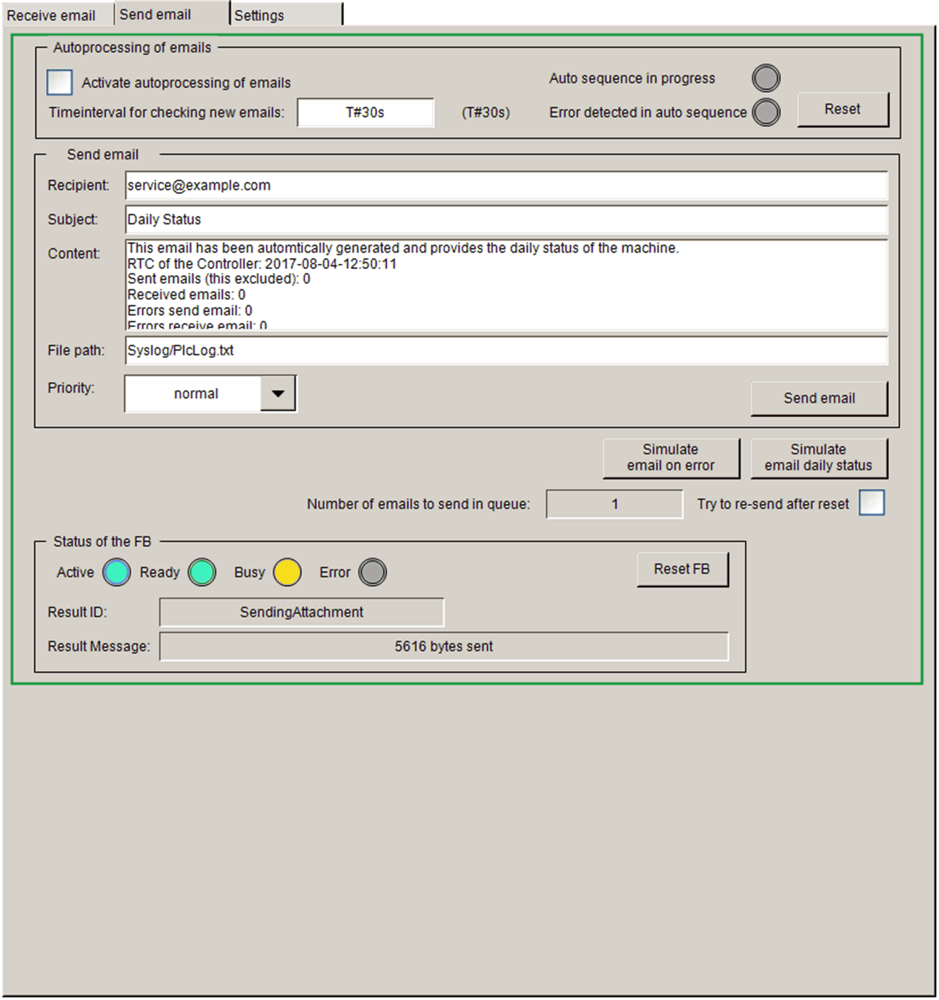
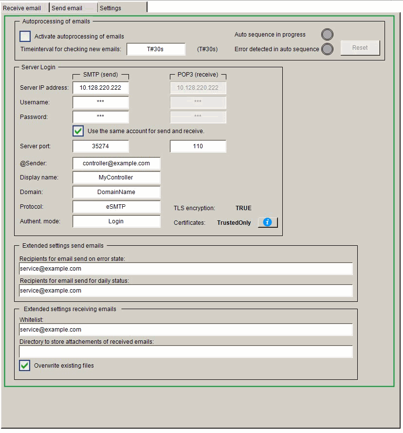

# Visualization Screens

## Overview

The application example implements a visualization in the Logic Builder that can be used to control and monitor an email client. Three visualization screens are provided that can be switched from the Visu\_Main.

## Receive email

Visu\_Main > Receive email

## Send email

Visu\_Main > Send email

## Settings

Visu\_Main > Settings

EIO0000002821.03