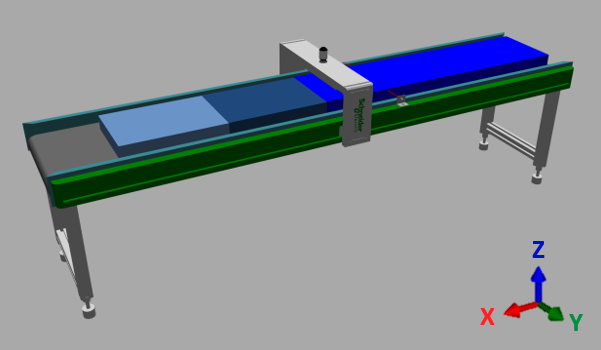

# Machine Purpose

The FlyingShear machine provides a solution to perform a process step typical for continuous manufacturing environments. In this example, a continuous product is fed through the system on a belt and the FlyingShear performs precise cutting operations on the fly, without stopping the belt. The challenge lies in synchronizing the cutting mechanism with the moving product, ensuring each cut is made at the correct position and timing.

EIO0000005660.00