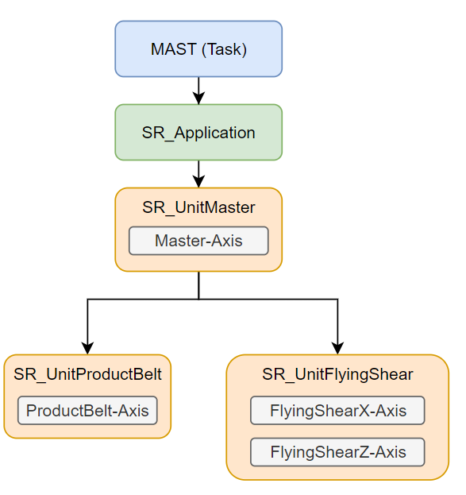

# Project Structure

## Overview of the FlyingShear Project

The FlyingShear project is executed in the default MAST task of the controller from the program SR\_Application.

## SR\_Application Program

The SR\_Application program is the entry point for the machine logic. It handles the administrative tasks that are not specific to a machine unit or a software unit, as, for example, managing the communication bus, the user interface, or providing error logging.

SR\_Application triggers the software unit SR\_UnitMaster.

## SR\_UnitMaster

The SR\_UnitMaster software unit is triggered by SR\_Application. It is not directly represented in the mechanical design but coordinates the functionality of the other units and provides a common master axis position to which the subunits synchronize.

## SR\_UnitProductBelt

The SR\_UnitProductBelt software unit represents the mechanical unit ProductBelt. It monitors and controls the ProductBelt axis.

## SR\_UnitFlyingShear

The SR\_UnitFlyingShear software unit represents the mechanical unit FlyingShear. It monitors and controls the FlyingShearX axis and the FlyingShearZ axis.

EIO0000005660.00