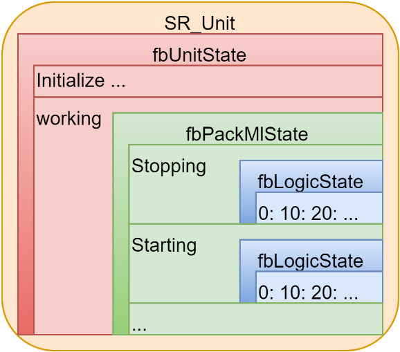
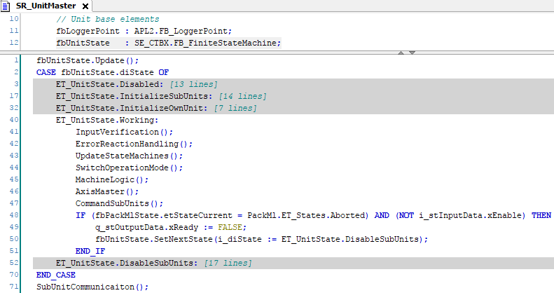
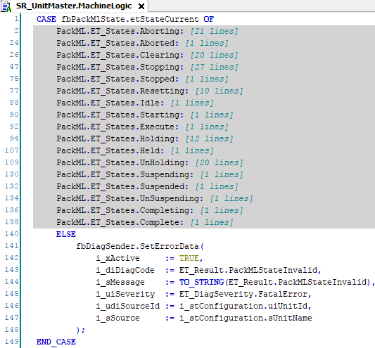

# Unit Structure

## Overview

A software unit consists of three nested state machines:

* fbUnitState
* fbPackMlState
* fbLogicState

Each is controlled by a dedicated function block within the private variables of SR\_Unit.

## fbUnitState State Machine

The fbUnitState state machine forms the outer layer of the three state machines. The states of the fbUnitState state machine are defined directly in the body of SR\_Unit.

The fbUnitState state machine mainly handles the enabling/initialization and disabling of the unit and the corresponding subunits. After initialization, the state machine remains in the working state, where the methods UpdateStateMachines and MachineLogic are called. MachineLogic holds the second layer state machine.

## fbPackMlState State Machine

The fbPackMlState state machine forms the intermediate state machine. It is not a general state machine but of type PackML.FB\_UnitModeManager2 to control a state machine according to the PackML standard. The state machine itself is updated in the method UpdateStateMachines. The states are defined in the MachineLogic action.

The machine behavior of the unit needs to be defined within the PackML states.

## fbLogicState State Machine

The fbLogicState state machine forms the inner state machine. This state machine has multiple definitions, one for each PackML state of the middle state machine (fbPackMlState). As only one PackML state can be active at a time, only one definition of the state machine is active at a time.

In the states of the fbLogicState, the unit actions are programmed, as, for example, powering an axis, moving an axis, sending information to a database. It is a good practice to use fbLogicState.xEntryAction as it helps to improve the readability of the code.

When cause and result are combined in one state, you can insert new states and read the code. Consequently, you do not have the cause programmed at the end of the previous state and the result verified with the cause for the next state.

EIO0000005660.00