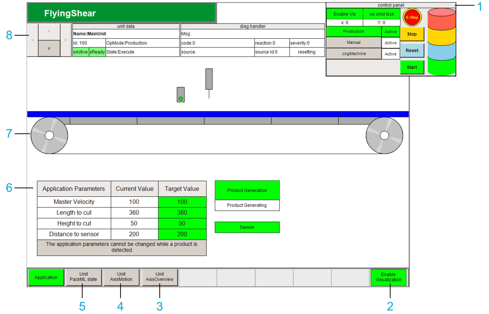

# Overview of the Visualization

The FlyingShear example application implements a visualization in the Logic Builder that can be used to control and monitor the application. To open the visualization, double-click the Vis\_FlyingShear subnode of the FlyingShear\_example > Application node. For an overview of the Devices tree, refer to [Controllers Represented in the Application](HW_in_Application-E775678C.html).

| Item | | Description |
| --- | --- | --- |
| 1 | | The control panel allows you to start, stop, emergency stop and reset the machine, or change the control modes. |
| 2 | | The Enable Visualization button enables the visualization. |
| 3 | | The Unit AxisOverview button displays the AxisMotion state and provides information about the axes for the unit selected with the arrow buttons and of the master axis. |
| 4 | | The Unit AxisMotion button displays the AxisMotion state machine and provides information about each axis for the unit selected with the arrow buttons. If there are two or more axes, use the arrows to switch between axes of the selected unit. Also refer to [*MotionFunctionBlocks Library Guide*](../../../../../api/crossBook?lang=en-US&virtualBookName=MoFBLib&topicID=FB_AxisMotion_411547B7). |
| 5 | | The Unit PackML state button displays the PackML state machine for the unit selected with the arrow buttons. Under the PackML state machine visualization, click the button activate debug Cmds to access various commands that you can send to the selected unit. |
| 6 | | The parameters of the FlyingShear. You can modify the machine parameters and start or stop product generation. |
| 7 | | The 2-dimensional representation of the FlyingShear machine. |
| 8 | | The arrow buttons allow you to switch between views of the different units in the application.  When a unit is selected, the following information is provided:   * Information related to the data of the unit (unit data). * Information related to the diagnostics (diag handler). |

EIO0000005660.00