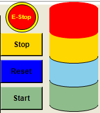
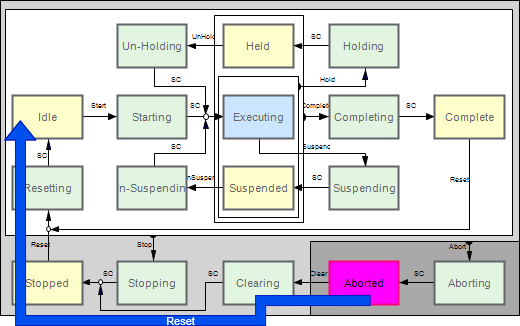
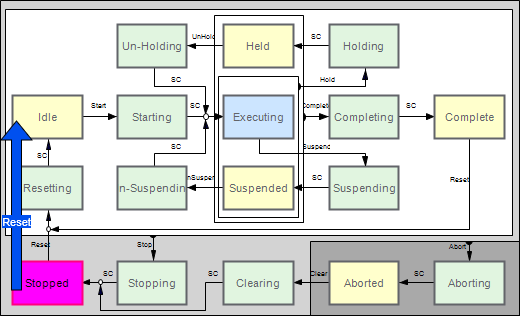
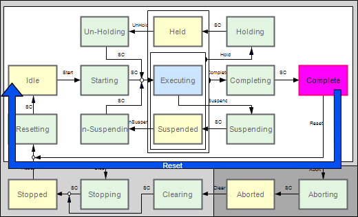
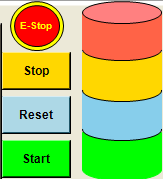
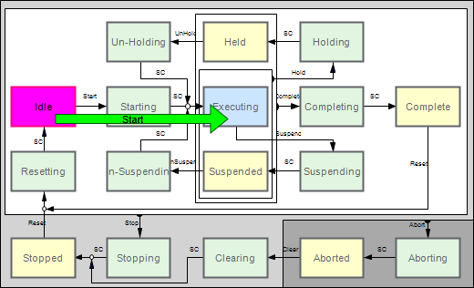
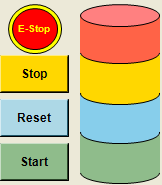
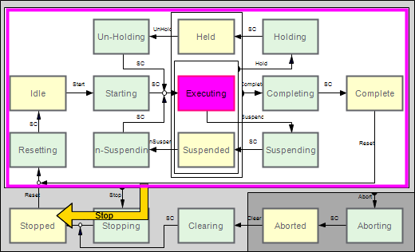
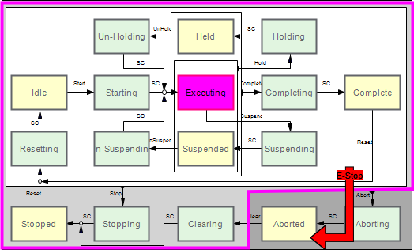

# Controls

## Control Buttons

A framework unit indicates the status according to the PackML state machine. As a typical machine user interface does not support the corresponding PackML commands, a function block and a visualization are provided to control the machine with the following buttons:

* Reset
* Start
* Stop
* Emergency Stop

The control buttons in the visualization of the example project are connected to the master unit of the program and thus affect the entire machine. They cannot be used to provide commands directly to subunits.

## Reset Button

The Reset button prepares the machine for a (new) start command. The behavior depends on the initial PackML state:

* Initial state = Aborted:

  Clicking the Reset button switches the machine to the states Clearing > Stopped > Resetting > Idle.

  
* Initial state = Stopped or Complete:

  Clicking the Reset button switches the machine to the states Resetting > Idle.

  

  

## Start Button

Clicking the Start button in Idle state switches the machine to the states Starting > Executing.

## Stop Button

Clicking the Stop button in a working state switches the machine to the states Stopping > Stopped.

## E-Stop Button

The E-Stop button has two states:

|  |  |
| --- | --- |
|  |  |
| E-Stop inactive | E-Stop activated |

Clicking the E-Stop button makes the machine leave the active state and switches to the states Aborting > Aborted.

## Stack Lights

In addition to the PackML state of the top machine unit, the status of the machine is displayed by stack lights in the visualization. For further information on the behavior of the stack lights, refer to the documentation of the [FB\_StacklightsAndButtons function block in the ApplicationFrameworkUtility Library Guide](../../../../../api/crossBook?lang=en-US&virtualBookName=AFULib&topicID=FB_StackLightsAndButtons_GeneralInf_3AE70A15).

EIO0000005660.00