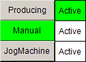

# Selecting the Unit Control Mode

## FlyingShear Unit Control Modes

The FlyingShear supports the following unit control modes:

* Producing

  The machine cuts the product.
* Manual

  You can move each axis of the machine independently with the jog buttons. (Product detection and monitoring is still active, but no machine logic or synchronous axis coupling is executed.)
* JogMachine

  The subunits of the machine operate like in unit control mode Producing, but the master unit behaves like in unit control mode Manual. Machine logic and product monitoring are active. The jog buttons allow you to move the master axis and, thus, the entire machine according to the Producing logic.

## Visualization Buttons for the Unit Control Mode

For each unit control mode, the visualization provides one button and one Active indicator.

To change a unit control mode, click the button Producing, Manual or JogMachine. The unit control mode that is active is indicated by a green Active indicator. This state is retrieved from the state Idle or Starting in the respective unit control mode in PackML.

EIO0000005660.00