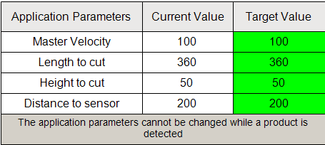

# Modifying Machine Parameters

The visualization allows you to modify the following machine parameters:

| Parameter | Description |
| --- | --- |
| Master Velocity | Velocity of the belt  Default value: 100 mm |
| Length to cut | Length of the cut on the product in mm. |
| Height to cut | The height that the FlyingShear cuts in mm. |
| Distance to sensor | The distance separating the product sensor from the rest position of the FlyingShear in mm. |

Modifications are allowed during machine execution but they only become effective when no product is on the belt.

EIO0000005660.00