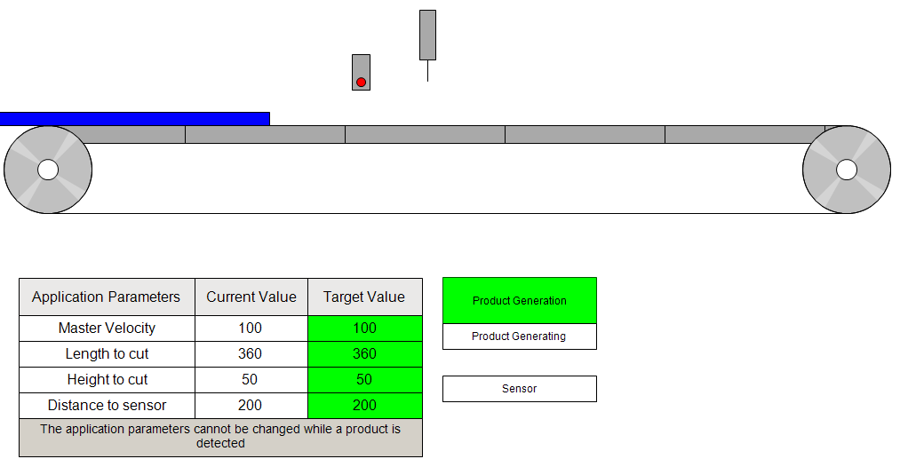

# Starting Product Generation

A product can be generated with the visualization. When the product is detected by the sensor, the FlyingShear is started.

The product generation can be stopped at any point during the process. A restart is only possible after the product has cleared the FlyingShear.

EIO0000005660.00