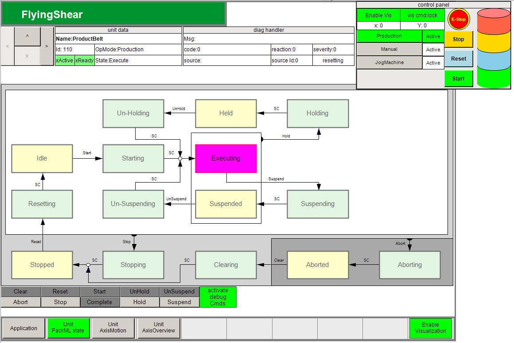

# Sending PackML Commands to Units

## Overview

To send PackML commands directly to a specific [software unit](Project-E77015E5.html), proceed as follows:

| Step | Action |
| --- | --- |
| 1 | Select the desired unit with the arrow buttons (ProductBelt or FlyingShear) from the top of the visualization window.  **Result**: The corresponding PackML state machine is displayed below the tab. |
| 2 | From the bottom of the visualization window, click the button activate debug Cmds and click one of the buttons to send the command to the selected unit. |

NOTE: The command from the visualization is sent in parallel to other possible command sources. As no priority is assigned to one source, the last command received is executed.

EIO0000005660.00