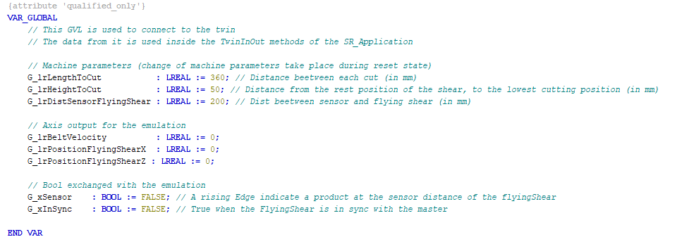

# Global Variable List: GVL\_Twin

The FlyingShear project contains the global variable list GVL\_Twin to connect to EcoStruxure Machine Expert Twin and visualize the movement of the FlyingShear.

The GVL\_Twin contains the different machine parameters that can be received from EcoStruxure Machine Expert Twin as well as the different axis positions or velocity that can be sent to EcoStruxure Machine Expert Twin.

EIO0000005660.00