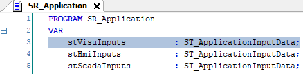
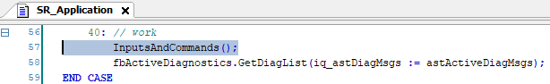
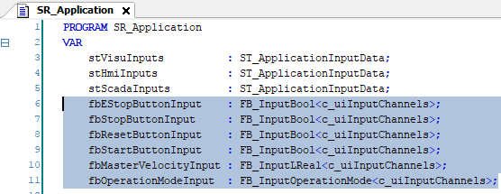
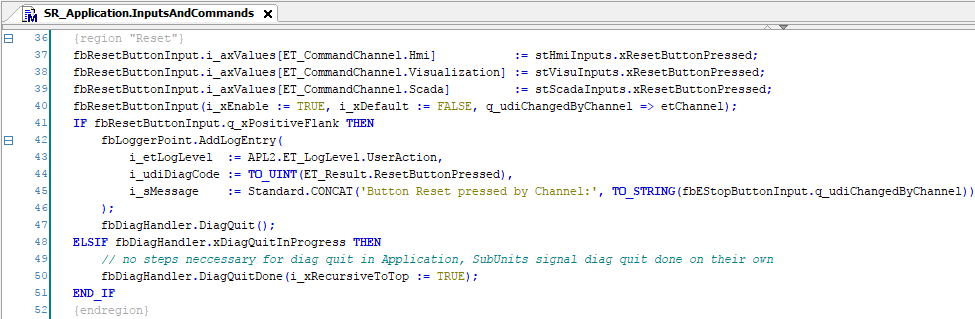
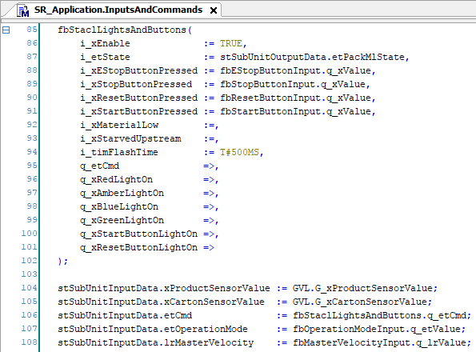

# Commands from the Visualization or EcoStruxure Machine Expert Twin to the First Unit

## Command Flow

The FlyingShear application contains the structure ST\_ApplicationInputData (refer to the [figures of the tree structure](HW_in_Application-E775678C.html)). It holds the command signals that can be sent to the machine (for example, start, stop, selected unit control mode, machine velocity).

Inside the [SR\_Application program](Project-E77015E5.html#Project-E77015E5__SR_Application-E77180C3), multiple instances of these input data are maintained, one for each source the input can come from (such as visualization, HMI, Scada). The [control buttons of the visualization](Controls-7B3FD551.html)  are connected to the stVisuInputs structure directly in the visualization.

When SR\_Application is in the working state, the method InputsAndCommands is called to retrieve the inputs.

In order to superimpose multiple command channels (like, for example, visualization and HMI), SR\_Application contains one function block per command signal. It combines the signals from the different sources into one command signal, as, for example xResetButtonPressed.

The InputsAndCommands method uses these function blocks to combine the sources and to provide diagnostics and logging information.

Afterwards, the combined information of the command buttons are provided to an instance of the [FB\_StacklightsAndButtons function block of the ApplicationFrameworkUtility library](../../../../../api/crossBook?lang=en-US&virtualBookName=AFULib&topicID=FB_StackLightsAndButtons_GeneralInf_3AE70A15). It generates PackML commands for the unit master. The commands are transferred to the unit together with the other input data for the unit master.

EIO0000005660.00