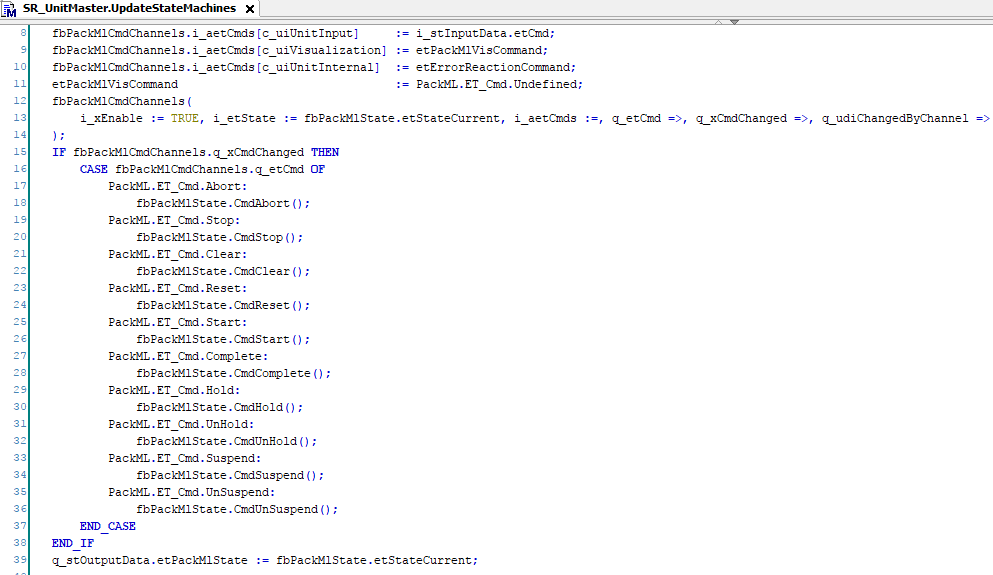
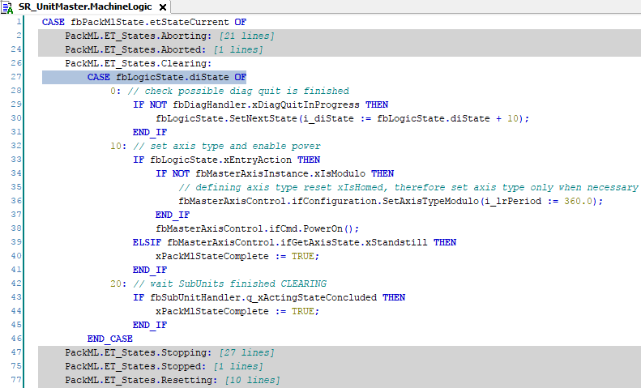
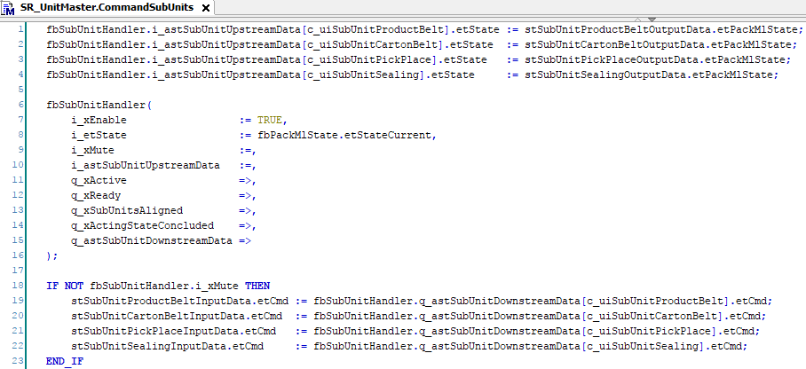

# Command Flow Inside a Unit

## Command Flow

With the input variable i\_stInputData.etCmd, a software unit receives a PackML command from a parent unit or from the [SR\_Application program](Project-E77015E5.html#Project-E77015E5__SR_Application-E77180C3). As a unit can receive PackML commands from the visualization and from the program logic, the signals of the different sources are combined. The combined and prioritized PackML command is then forwarded to the [fbPackMlState state machine](UnitStructure-7B386B73.html#UnitStructure-7B386B73__FbPackMlStateStateMachine-7B3BAACC).

The change of the PackML state triggers the execution of a new list of states in the MachineLogic part of the unit (also refer to [fbLogicState State Machine](UnitStructure-7B386B73.html#UnitStructure-7B386B73__FbLogicStateStateMachine-7B3C6F64)).

Inside the logic states, the movement commands for the axis are triggered that are directly controlled by the unit.

If one or multiple subunits are connected to the unit, by default the fbSubUnitHandler in the method CommandSubUnits generates PackML commands for the subunits so that the subunits transition to the same PackML state as the fbSubUnitHandler.

By default, the subunits and the parent unit execute their PackML commands in parallel. If there are restrictions to this, like interlocking mechanical actions in the unit, the i\_xMute input of fbSubUnitHandler can be set to TRUE to prevent it from generating commands. Instead, the program logic can generate the subunit commands itself congruent with the timing inherent in the design of the application. When afterwards i\_xMute is set to FALSE again, fbSubUnitHandler continues to operate from the present situation.

For further information on subunit command handling, refer to the documentation of the [FB\_PackMlSubUnitHandler function block in the ApplicationFrameworkUtility Library Guide.](../../../../../api/crossBook?lang=en-US&virtualBookName=AFULib&topicID=FB_StackLightsAndButtons_GeneralInf_3AE70A15)

EIO0000005660.00