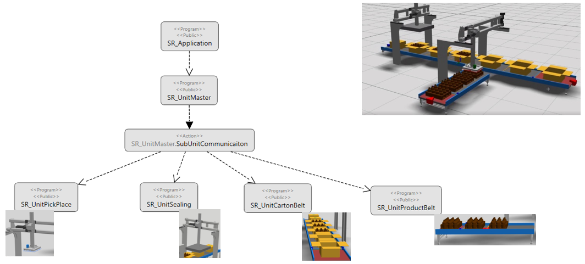
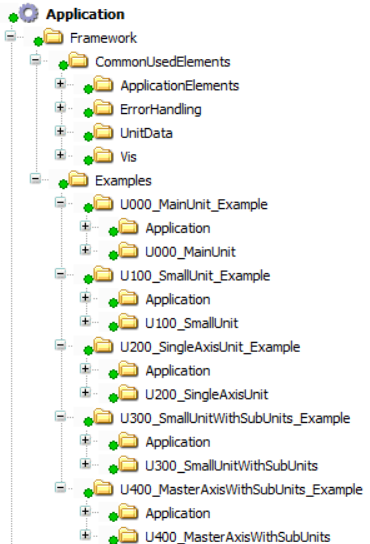

# Framework Project Overview

## Overview

The Framework project provides a program structure with predefined units for various use cases. To start a new project on this basis, copy the predefined program code and customize the provided core functions to your individual requirements.

In general, a framework project consists of the entry point SR\_Application and different units as illustrated in the example of the TopLoader machine.

The SR\_Application program is the entry point for the machine logic of the TopLoader. It handles the administrative tasks that are not specific to a machine unit or a software unit, as, for example, managing the communication bus, managing the communication with periphery elements such as HMIs or I/O modules, providing error logging.

SR\_Application directly triggers the software unit SR\_UnitMaster.

For detailed information, refer to the [TopLoader Example Guide](../../../../../api/crossBook?lang=en-US&virtualBookName=exTopLoader&topicID=SWProject_7AD354FE).

For a general information on software units, refer to [Units](Units-A988AAA1.html).

## Representation in the Applications tree

The Framework project is represented in the Applications tree of the Logic Builder by a folder for commonly used elements and several example folders with different units providing application examples of different complexity.

| Folder |  | Description |
| --- | --- | --- |
| CommonUsedElements | | Contains several function blocks for common tasks, such as error handling. |
| Examples | | Contains the examples sub folders. Each example contains an SR\_Application entry point and a unit for specific use cases. |
|  | U100\_SmallUnit | * Core unit functionality (enable/disable, initialization) * PackML state and command handling * Diagnostic generation and reaction handling * Logging using the Application logger |
| U200\_SingleAxisUnit | Extension of U100\_SmallUnit example providing additional example code to control an axis. |
| U300\_SmallUnitWithSubUnits | * Small unit containing subunits. * Extension of U100\_SmallUnit with FB\_PackMLSubUnitHandler to set the state of the subunits. * Uses the same example code as U100\_SmallUnit but grouped in subunits. |
| U400\_MasterAxisWithSubunits | * Extension of U300\_SmallUnitWithSubUnits providing a master axis. * Example code to handle diagnostic reactions for StopEndOfCycle and SynchronStop. * Uses the same subunits as U200\_SingleAxisUnit for use as subordinate axis. |

EIO0000005659.00