# Units

## Definition of Units

* A software unit represents a self-contained mechanical unit of a machine with the following characteristics:

  + A unit is a part of the machine that can operate individually without relying on external code.
  + A unit supports a standardized and small interface to other units.
  + A unit is treated as an individual machine with a PackML state machine in this example. Other approaches are also possible.
* A unit controls the machine part in every machine situation (off, start up, producing, error, maintenance).
* Each mechanical unit of a machine is controlled by one software unit.

## Encapsulated and Self-Contained Units

The structures for units are not specified. You can define them according to your specific requirements.

In the Framework project, the data structure examples are organized as follows:

* Input data

  + Commands (PackML states, operation mode…)
  + Application data (product handling, format, … )
* Output data

  + state bit (Ready, Active)
  + present PackML state
* Configuration data

  + Hardware (Axis, Sensor…)
  + Unitname, UnitId

## Standalone or Linked Units

You can use units individually or link them according to your requirements.

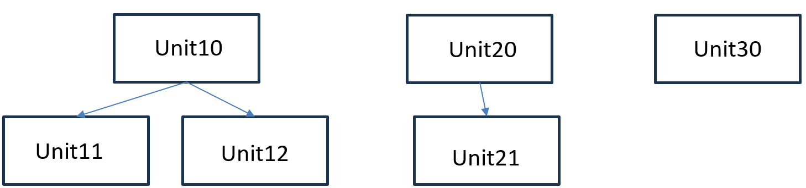

Each Framework project starts with the SR\_Application program that serves as an entry point for external data.

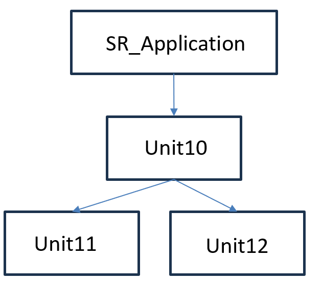

## Composition View

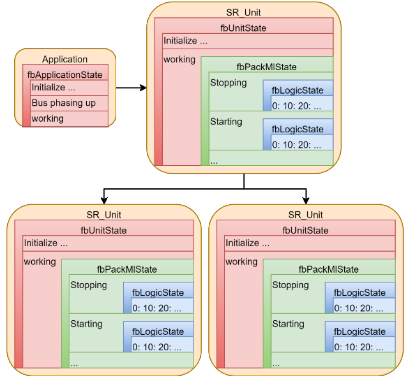

## Unit Structure

A software unit consists of three nested state machines:

* fbUnitState
* fbPackMlState
* fbLogicState

Each is controlled by a dedicated function block within the private variables of SR\_Unit.

## fbUnitState State Machine

The fbUnitState state machine forms the outer layer of the three state machines. The states of the fbUnitState state machine are defined directly in the body of SR\_Unit.

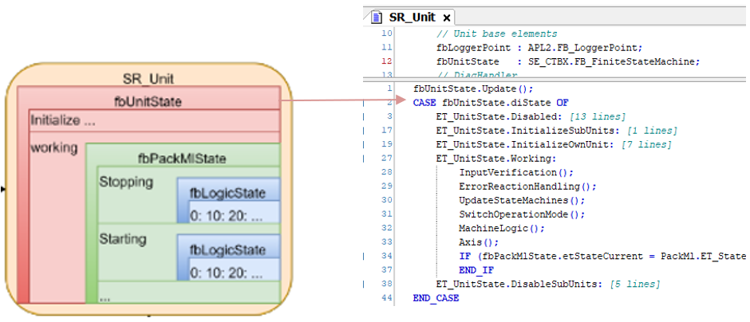

The fbUnitState state machine mainly handles the enabling/initialization and disabling of the unit and the corresponding subunits. After initialization, the state machine remains in the working state, where the methods UpdateStateMachines and MachineLogic are called. MachineLogic holds the second layer state machine.

## fbPackMlState State Machine

The fbPackMlState state machine forms the intermediate state machine. It is not a general state machine but of type PackML.FB\_UnitModeManager2 to control a state machine according to the PackML standard. The state machine itself is updated in the method UpdateStateMachines. The states are defined in the MachineLogic action.

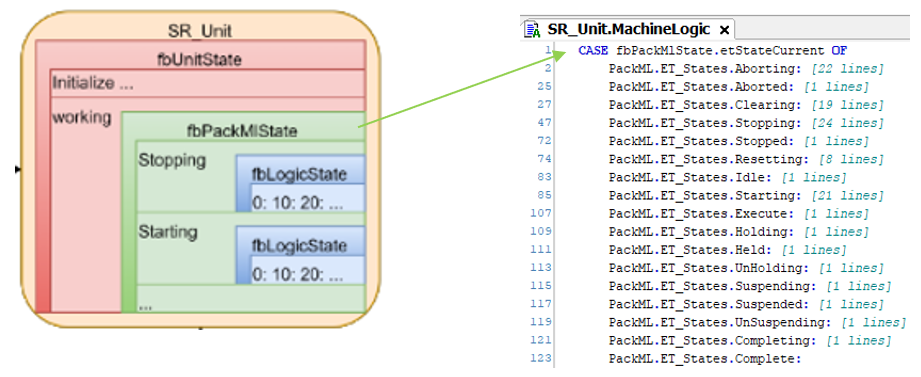

The machine behavior of the unit needs to be defined within the PackML states.

## fbLogicState State Machine

The fbLogicState state machine forms the inner state machine. This state machine has multiple definitions, one for each PackML state of the middle state machine (fbPackMlState). As only one PackML state can be active at a time, only one definition of the logic state machine is active at a time.

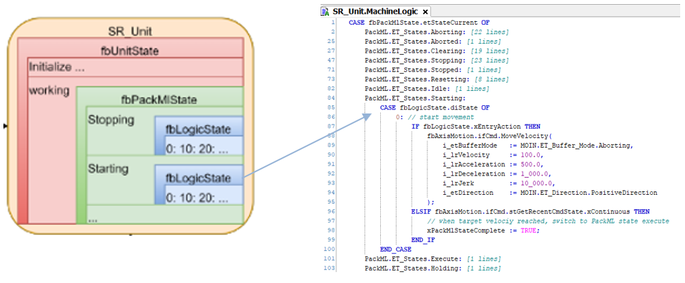

In the states of the fbLogicState, the unit actions are programmed, as, for example, powering an axis, moving an axis, sending information to a database. It is a good practice to use fbLogicState.xEntryAction as it helps to improve the readability of the code.

When cause and result are combined in one logic state, you can insert new states and read the code. Consequently, you do not have the cause programmed at the end of the previous state and the result verified with the cause for the next state.

## Definition of PackML States in a Unit

The units implement a behavior according to the PackML state machine. The Framework uses the [FB\_UnitModeManager2 of the PackML library](../../../../../api/crossBook?lang=en-US&virtualBookName=PackMLli&topicID=TPC_PackMLli_FB_UnitModeManager2) for defining which PackML states are used in a unit and how to process them.

The figure provides an overview of the available PackML states and indicates which state is triggered by which command as well as the state transition from an acting state to the subsequent state with the method call StateComplete (SC).

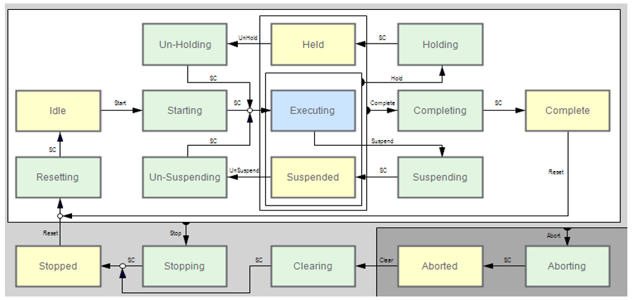

Wait states (such as Stopped, Idle, Complete) are displayed in yellow.

Acting states (such as Starting, Clearing, Resetting) are displayed in green.

For information on switching between states, refer to [Switching States](#Units-A988AAA1__SwitchingStates-AA0B3E88).

A unit instances the FB\_UnitModeManager2 from the PackML library for processing the states.

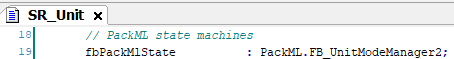

By default, all available PackML states are enabled. The [DefineUnitMode method](PackMLli::TPC_PackMLli_FB_UniMdMng2_DefineUnitMode) of the FB\_UnitModeManager2 allows you to disable states that are not to be used for this unit.

## Unit Control Modes

You can define different states for the individual operation modes, that are defined as unit control modes in the ANSI/ISA TR88.00.02-2015 standard, such as Production or Maintenance. Different unit control modes can be used, but it is not mandatory.

**Example: Disable the two states relative to Complete for the unit control mode Production**

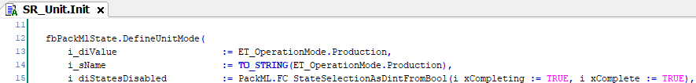

|  |  |
| --- | --- |
|  |  |

**Example: Disable the two Complete, three Holding and three Suspend states for the unit control mode Manual**

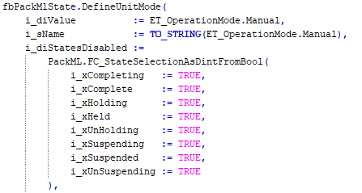

|  |  |
| --- | --- |
|  |  |

## Switching Unit Control Modes

If you are using different unit control modes, such as Production, Maintenance or Manual, it is required to define in which state or states it is allowed to switch from one mode to another mode.

Example:

The two modes Production and Manual are used.

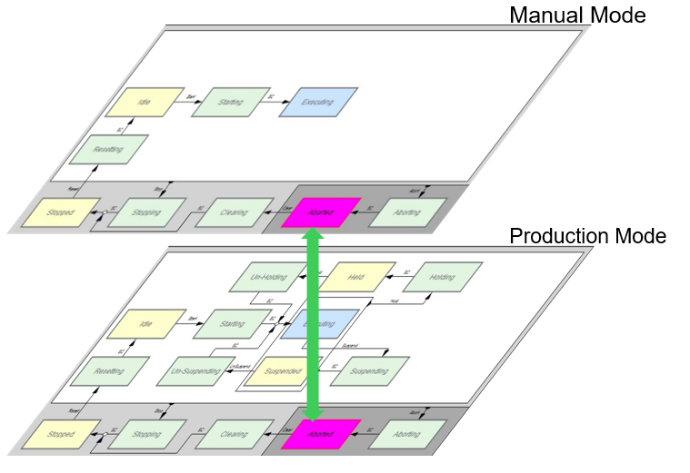

To be able to switch in the state Aborted from Production mode to Manual mode, the following prerequisites must be fulfilled:

* The switch from Production mode to Manual mode must be enabled.
* The Manual mode must also be in the state Aborted.
* In both modes, the same state must be available as indicated by i\_diStatesModeChangeAllowed in the following code example.

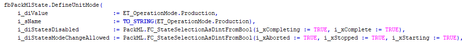

## Switching States

For an overview of the two types of states, wait states and acting states, refer to the section [Definition of PackML States in a Unit](../../../../../api/crossBook?lang=en-US&virtualBookName=#Units-A988AAA1__DefinitionOfPackMLStatesInAUnit-A9A04FC1). The PackML diagram provided in this section indicates which state is triggered by which command as well as the state transition from an acting state to the subsequent state with the [method call StateComplete (SC)](../../PackMLli&topicID=TPC_PackMLli_IF_StateCommands_StateComplete).

Example:

The `Start` command is called to enter the Starting state. The StateComplete method call switches to the next state Executing.

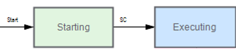

In the PackML library, the following interface methods are provided by the function block FB\_ModuleManager2 to execute a command (such as `Start`, `Stop`) or a StateComplete to perform the state transition.

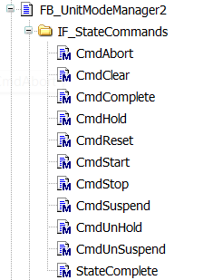

In the Framework project, the commands are called in the method UpdateStateMachines.

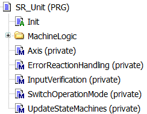

EIO0000005659.00