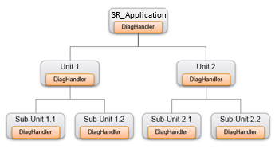
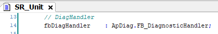
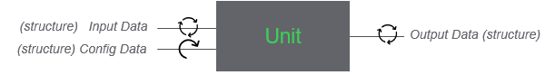
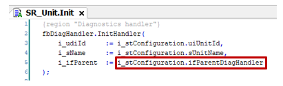
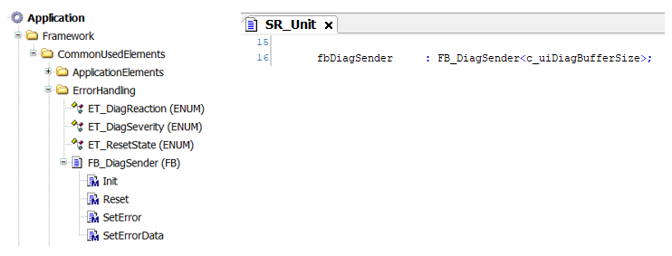
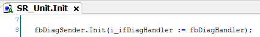
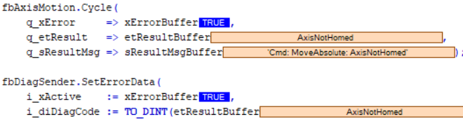
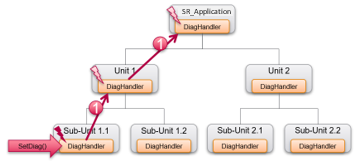
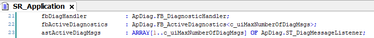
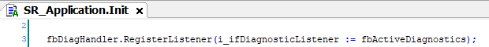

# Handling Diagnostic Messages in Units

## Configuring a Logical Structure

Each unit of the Framework project uses the FB\_DiagnosticHandler of the [ApplicationDiagnostic library](../../../../../api/crossBook?lang=en-US&virtualBookName=AppDiag&topicID=FB_DiagnosticHandler_37539FB4). The function block provides several methods and properties to receive diagnostic messages, process them by triggering appropriate reactions and forward them to other diagnostic handlers.

It allows you to configure a logical structure of diagnostics handling according to the architecture of your machine.

To achieve this, each unit instances an FB\_DiagnosticHandler.

The parent diagnostic handler of a unit is specified in the configuration data.

It is assigned by the InitHandler method of the FB\_DiagnosticHandler.

## Sending Diagnostic Messages

The FB\_DiagSender function block is provided in the Framework project and instanced in a unit for sending diagnostic messages.

The `fbDiagSender` is linked to its `fbDiagHandler` in the `Init` action of the unit.

## Error Detection

If an error is detected, the SetErrorData method of the function block FB\_DiagSender forwards the detected error to its FB\_DiagnosticHandler if the input i\_xActive is set to TRUE.

The code example indicates that when an error is detected on the `fbAxisMotion`, the detected error is indicated with the SetErrorData method.

## Forwarding Diagnostic Messages within the Structure

By default, the diagnostic message is forwarded by each unit to the respective parent diagnostic handler until it reaches the diagnostic handler of the highest level in SR\_Application.

You can link a listener that provides a list of active diagnostic messages to the FB\_DiagnosticHandler. To achieve this, register an instance of the function block [FB\_ActiveDiagnostics of the ApplicationDiagnostic library](../../../../../api/crossBook?lang=en-US&virtualBookName=AppDiag&topicID=FB_ActiveDiagnostics_41991B97) to an instance of the FB\_DiagnosticHandler.

In the SR\_Application an instance of the FB\_ActiveDiagnostics is available.

Register it to the FB\_DiagnosticHandler:

For information about forwarding messages, refer to the [ApplicationDiagnostic library](../../../../../api/crossBook?lang=en-US&virtualBookName=AppDiag&topicID=GeneralInformation_36C3BA2C)

EIO0000005659.00