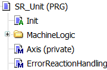
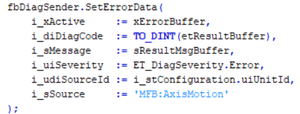
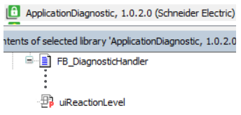
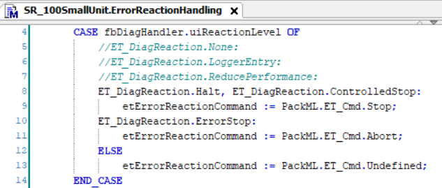
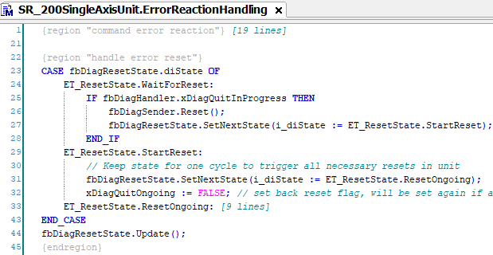
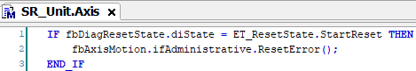

# Reacting Upon Diagnostic Messages in the Framework

## Overview

The reaction to a diagnostic message of a unit is performed in the method ErrorReactionHandling.

A diagnostic message includes a severity level, such as Error.

The Framework project provides an enumeration of the severity level and an enumeration of the reaction level.

|  |  |
| --- | --- |
|  |  |

By default, the FB\_DiagnosticHandler transfers the severity level into the reaction level one-to-one and provides the property uiReactionLevel for programming the error handling. For further information, refer to the [FB\_DiagnosticHandler](../../../../../api/crossBook?lang=en-US&virtualBookName=AppDiag&topicID=FB_DiagnosticHandler_37539FB4).

The error handling is programmed in the Framework project in a case-statement of the method ErrorReactionHandling. You can modify it to meet your specific requirements.

Example: At the reaction level HALT or CONTROLLEDSTOP, the PackML state machine is commanded to the state Stopping.

The method ErrorReactionHandling provides another case-statement in which the reset of diagnostic messages is managed. As soon as a reset is in progress of the FB\_DiagnosticHandler, the state is changed to StartReset.

This state is, for example, evaluated in the Axis method, in which a reset of the FB\_AxisMotion is triggered.

EIO0000005659.00