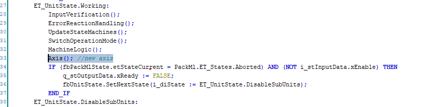

# Adding an Axis

This example demonstrates how to add an axis to a unit that is based on SR\_100SmallUnit of an existing project. For a new project, you can use the unit U200\_SingleAxisUnit.

The axis is enabled in the Clearing state and stopped in the Aborting state . An example movement is added to the Execute state.

| Step | Action |
| --- | --- |
| 1 | Add an instance of FB\_AxisMotion to the unit. |
| 2 | Add IF\_Axis to the unit config structure.  NOTE: Accessing the axis through the configuration structure increases the reusability of the unit. Handle the devices of the units with the input structure. |
| 3 | Assign the axis in the SR\_Application.init. |
| 4 | Initialize the axis motion in the `Init` method of the unit. |
| 5 | In the Axis method, call the FB\_AxisMotion cyclically. A verification of error messages is performed. |

The Axis method is called cyclically in the working state of the unit.

The Axis method allows one method per axis that contains the axis handling (as, for example, Reset of the axis). This has the effect that, outside of the method, only motion commands need to be handled. No additional handling is required.

EIO0000005659.00