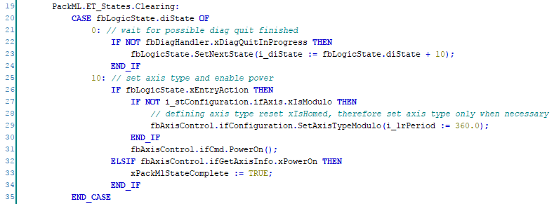
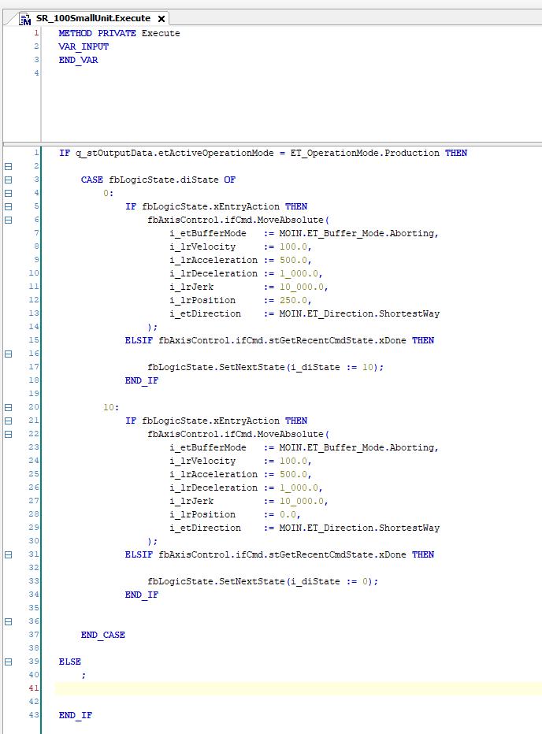
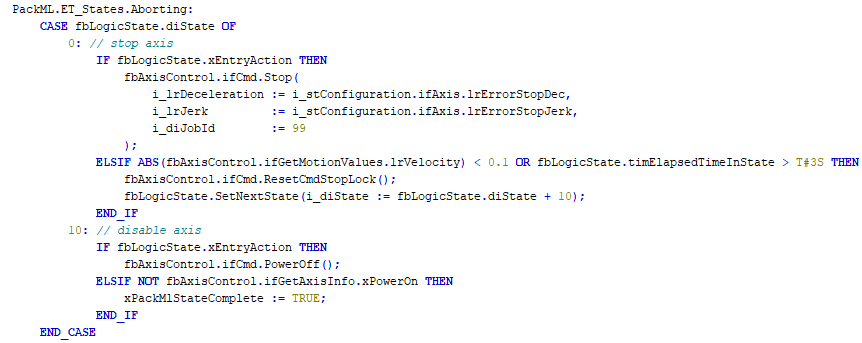

# Adding Axis Motion Commands

## Overview

This chapter demonstrates how to set motion commands depending on the PackML state. The following examples have been created in accordance with the [Unit Behavior in PackML States](UnitPackML-AD1C805B.html).

## Enabling the Axis in State Clearing

## Axis Movement in State Execute

## Stopping the Axis in State Aborting

EIO0000005659.00