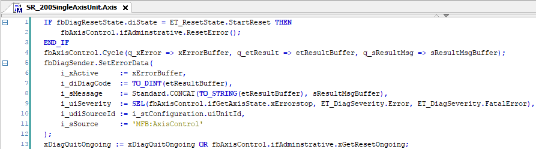
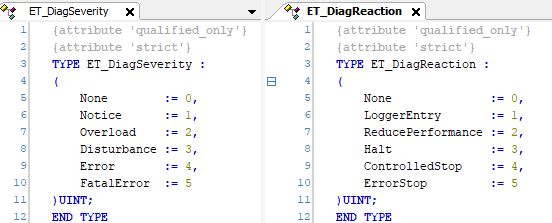
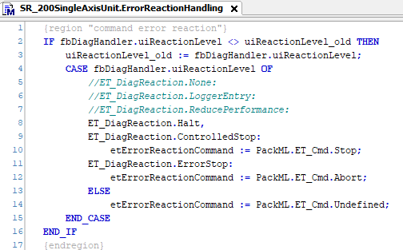
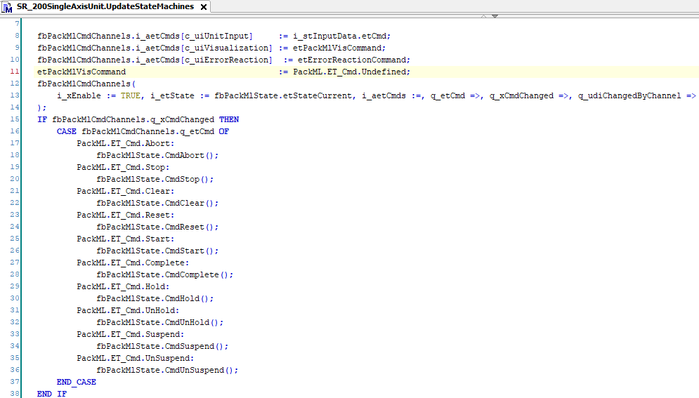
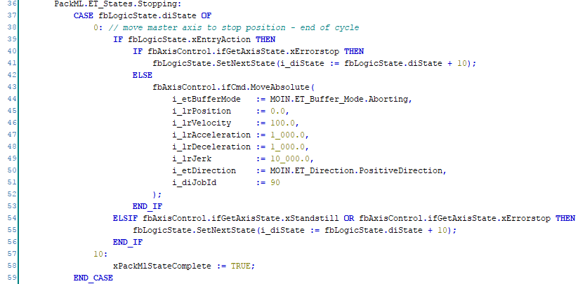
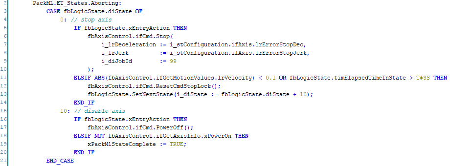

# Defining Reactions on Detected Errors

## Overview

This chapter provides the example of reacting on a detected axis error.

## Detecting an Axis Error

An axis error is detected after the cyclic call of the AxisMotion where the diagnostic message is set.

Errors that are detected by the FB\_DiagnosticHandler have a severity ET\_DiagSeverity. Depending on the severity level, the diagnostic handler returns a reaction level ET\_DiagReaction. By default, the FB\_DiagnosticHandler transfers the severity of a detected error to a DiagReaction one-to-one, based on the number of the severity and the number of the reaction. Also refer to [Reacting Upon Diagnostic Messages in the Framework](ReactDiagnostics-ABAFCEE1.html).

The severity of a detected axis error is ET\_DiagSeverity.Error.

The ErrorReactionHandling method converts the reaction level into a PackML command.

The method UpdateStateMachines sets the PackML state with the PackML command.

## Reactions to the Detected Errors

The error reaction is defined in the PackML state. In the Stopping state, the axis moves to a defined position if the axis is not in an error state itself. If it is in an error state, it leaves the Stopping state without an action.

**Example: A detected error leads to an end-of-cycle stop in Stopping state.**

**Example: When a FatalError is detected, the Aborting state is entered and the axis is stopped with a stop command.**

EIO0000005659.00