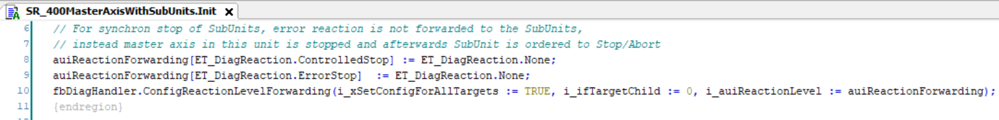
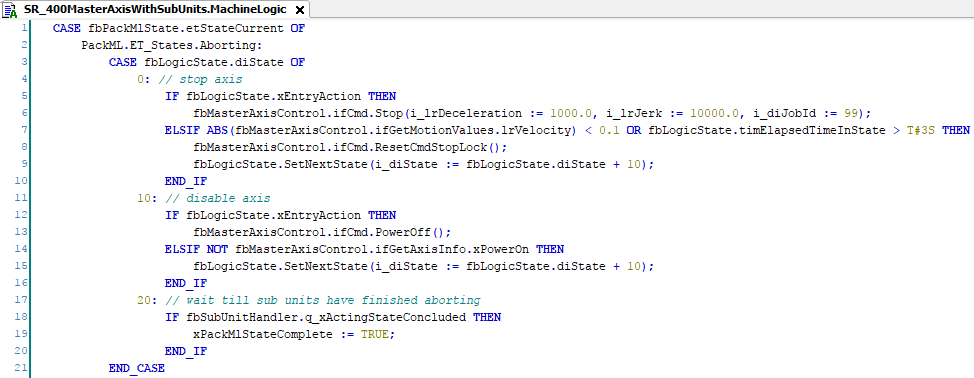
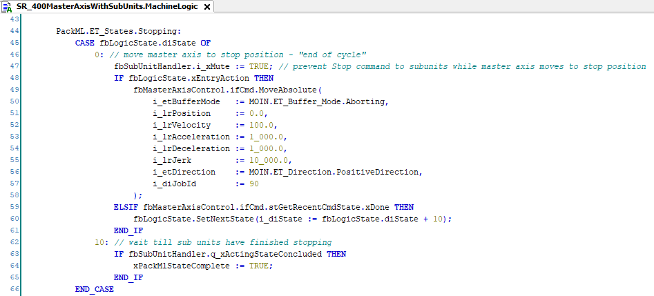

# Stopping a Master with a Subunit

## Overview

This chapter describes a master unit with several subunits that follow the master in the operating state SynchronizedMotion (for example, CamIn).

## Synchronous Stop

When a synchronous stop is to be performed, the master disables the error forwarding to the subunits, so that the subunits do react.

In addition, the FB\_PackMLSubUnitHandler must be muted during the stop, to prevent PackML commands from being sent to the subunits.

The unit SR\_400MasterAxisWithSubUnits includes a synchronous stop with the subunits.

**Example: The master unit disables the error forwarding.**

**Example: The fbSubunitHandler is muted in Aborting state.**

The commands are not forwarded to the subunits as long as the i\_xMute input of the fbSubUnitHandler is set to TRUE. The master axis stops in the Aborting state and the subunits are expected to follow in Execute state. When the master is stopped, the fbSubunitHandler is unmuted (cyclic reset in method CommandSubUnits) and the subunits get the command to go in Aborting state.

## Asynchronous Stop

If the fbSubUnitHandler is not muted (as described in [Synchronous Stop](#StopMaster-ADA77B3B__SynchronousStop-ADA9A437)), in the Aborting state the command `abort` is sent to the subunits and they go to Aborting state. The command in this state (as, for example, `Stop`) is executed immediately.

This can also be achieved by changing the error reaction forwarding.

The master forwards the reaction level. The subunit uses the ErrorReactionHandling method to monitor for detected errors and goes to Aborting state if an error is detected in the master.

## End-of-Cycle Synchronous Stop

The end-of-cycle synchronous stop performs the same behavior as in [Synchronous Stop](#StopMaster-ADA77B3B__SynchronousStop-ADA9A437) with the difference that the master is moved (for example, with MoveAbsolute) to a defined position instead of stopping. This can be achieved in the Stopping state.

EIO0000005659.00