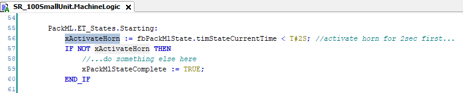
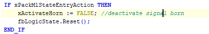

# Activating a Horn

You can activate a horn using the PackML state Starting.

Use the timer of the state machine function block fbPackMlState.timStateCurrentTime to configure the switch-on time and to delay the starting state.

To deactivate the horn in case the Starting state is interrupted, use the UpdateStateMachines() method. It allows you to deactivate the horn with every state change.

EIO0000005659.00