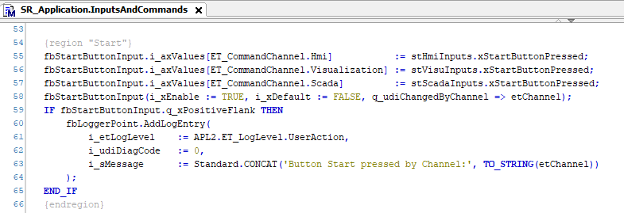
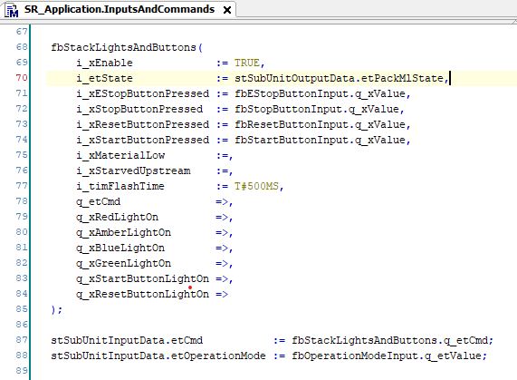
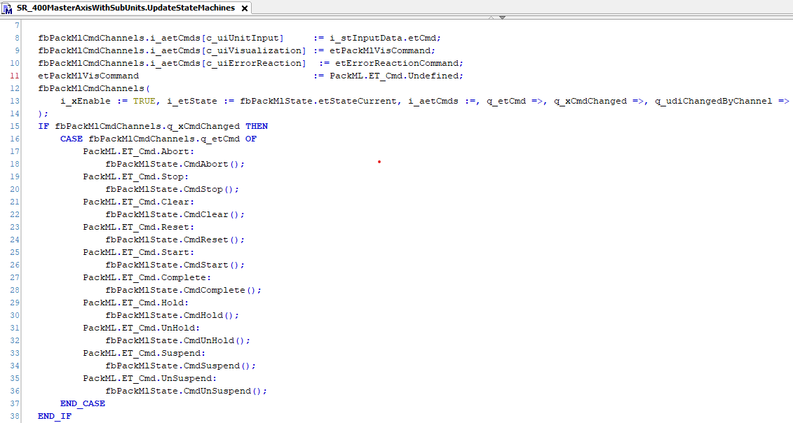

# Finding the I/O Handling

The Framework project indicates in SR\_Application.InputsAndCommands how to collect commands from different sources.

The function block FB\_StacklightsAndButtons converts the signals to PackML commands. The command signal is forwarded to the units with the input structure i\_stInputData.

In the units, the commands from user inputs and from error reactions are collected and prioritized. The command with the highest priority is set to go to the PackML state.

EIO0000005659.00