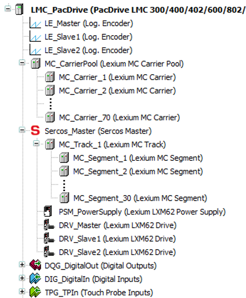
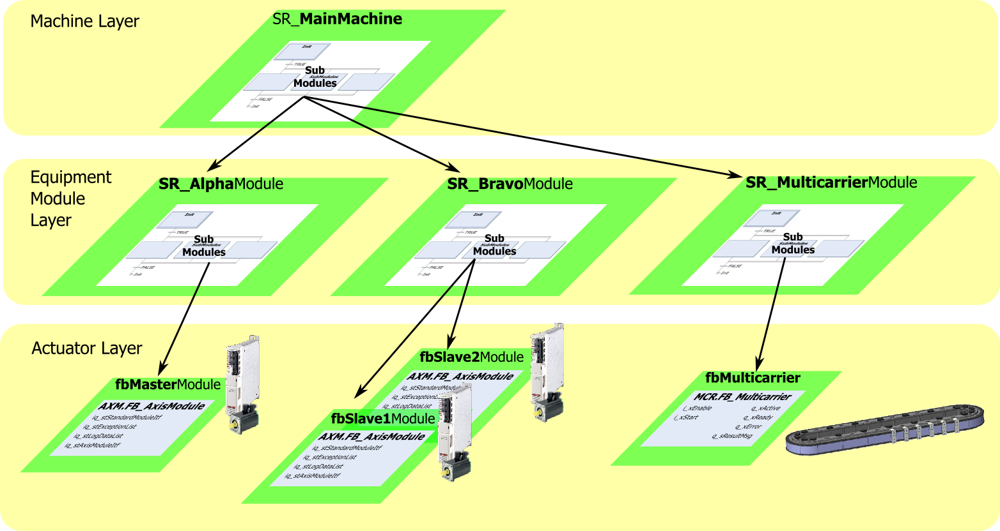
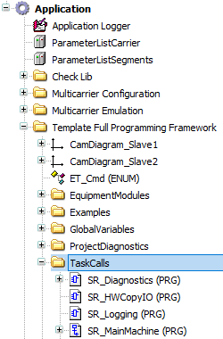

# Overview of the Application

## Position in the Devices Tree

The hardware objects are mapped in the Devices tree of the project. In the example project, 70 carriers and 30 segments are already implemented.

## Equipment Module Layer

In the template, the hardware is mapped in three equipment modules on the Equipment Module Layer: SR\_AlphaModule, SR\_BravoModule and SR\_MulticarrierModule.  
SR\_AlphaModule and SR\_BravoModule are contained in the PacDrive 3 Template Full which is also used with the Lexium drives.   
In SR\_MulticarrierModule, the function block FB\_Multicarrier from the Multicarrier library is implemented in the Actuator Layer.

For more information on the function block FB\_Multicarrier, refer to the [Multicarrier library](../../../../../api/crossBook?lang=en-US&virtualBookName=MLSLib&topicID=FB_Multicarrier_5B874FA7).

  

The subroutine SR\_MainMachine is located in the folder TaskCalls:

EIO0000004218.06