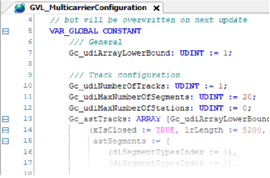
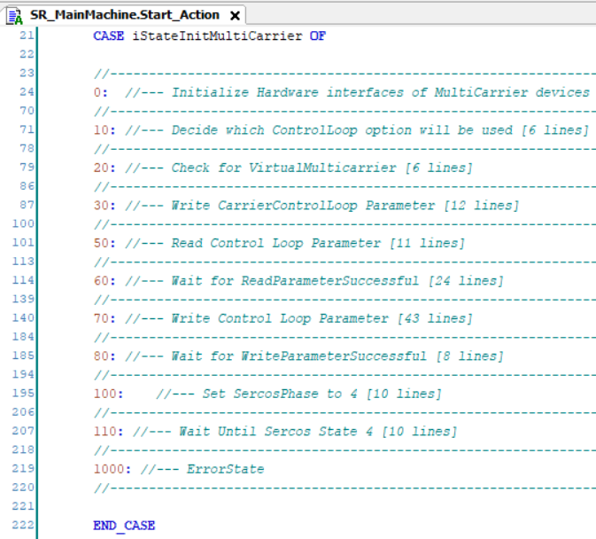
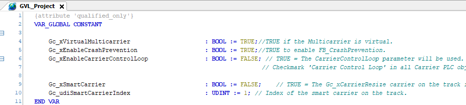
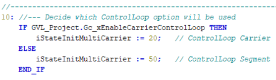
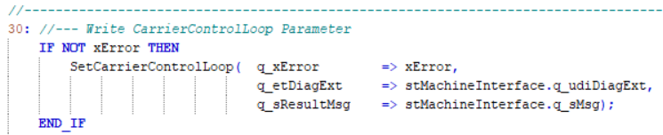
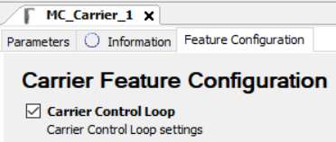
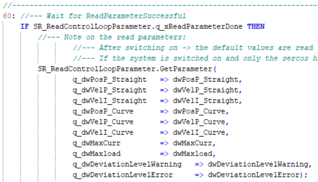
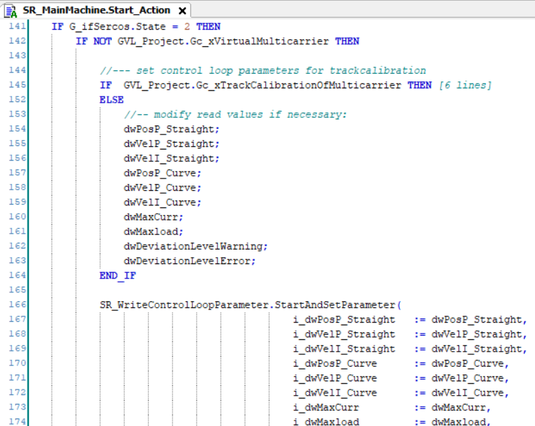

# Multicarrier Configuration

## Multicarrier Configuration Editor

The project uses the generated variables from the global variable list GVL\_MulticarrierConfiguration of the Multicarrier Configuration editor. The global variable list GVL\_MulticarrierConfiguration can be found in the folder MulticarrierConfiguration.

For changing the configuration, for example if you want to decrease the number of carriers, you have two possibilities:

* You change the configuration in the global variable list GVL\_MulticarrierConfiguration (see example below).
* You change the Multicarrier Configuration object and update the code.

## SR\_MainMachine

In the action SR\_MainMachine.Start\_Action, you find an additional state machine for parametrizing and activating the Multicarrier. In the project, the Sercos phase is set to zero per default.

The following graphic illustrates the different states along with comments for the corresponding processes:

In the following sections, you find some detailed descriptions for state 0, state 10, state 30 as well as state 60 and 70.

## SR\_MainMachine - State 0

| Stage | Description |
| --- | --- |
| **1** | The device objects must be assigned to an interface in the local structure stMulticarrierModule. Use the methods AssignSegments and AssignCarriers.  The structure is transferred to the SR\_MulticarrierModule.  NOTE: The project is conceived for 30 segments and 70 carriers. If you want to increase these numbers, you must add the appropriate number of segments/carriers in the methods AssignSegments and AssignCarriers. |
| **2** | There are two global parameters in the Multicarrier library to set the corresponding number of hardware elements. These variables must also be adjusted if you change the number of carriers or segments: |
| **3** | In case of running a physical device, the working mode is set to Real for the appropriate segments by setting the variable Gc\_xVirtualMulticarrier to FALSE.  In case of running a virtual device, the working mode is set to Virtual for the appropriate segments by setting the variable Gc\_xVirtualMulticarrier to TRUE. |
| **4** | The working direction from the global variable list GVL\_MulticarrierConfiguration is written to the track object. |
| **5** | The Sercos phase is set to 2. |

## SR\_MainMachine - State 10

It is the status of the global variable Gc\_xEnableCarrierControlLoop that determines whether the control loop parameters of the carrier or of the segment (default setting) are used.

## SR\_MainMachine - State 30

Write the control loop parameters per carrier.

NOTE: For enabling the writing of control loop parameters per carrier, you must select the feature Carrier Control Loop in the Feature Configuration of the carrier object.

For more information on configuring the control loop settings per carrier, refer to [Lexium™ MC multi carrier Device Objects and Parameters Guide](../../../../../api/crossBook?lang=en-US&virtualBookName=MCRDOaPG&topicID=CarrCtrlLoop_8EE5F492).

## SR\_MainMachine - State 60

Read the default control loop parameters from the segments.

## SR\_MainMachine - State 70

Modify the default control loop parameters and write them to the segments.

## SR\_MulticarrierModule

For mapping the hardware configuration to the Multicarrier library, the action Init\_Track in the subroutine SR\_MulticarrierModule is used.

In this action, the generated global variables in the global variable list GVL\_MulticarrierConfiguration of the Multicarrier Configuration editor are used. This means that when using the Multicarrier Configuration editor, the configuration of the library is automatically adapted.

| Item | Description |
| --- | --- |
| **1** | Structure with segment interfaces transferred from SR\_MainMachine |
| **2** | Variable from the Multicarrier Configuration editor |

EIO0000004218.06