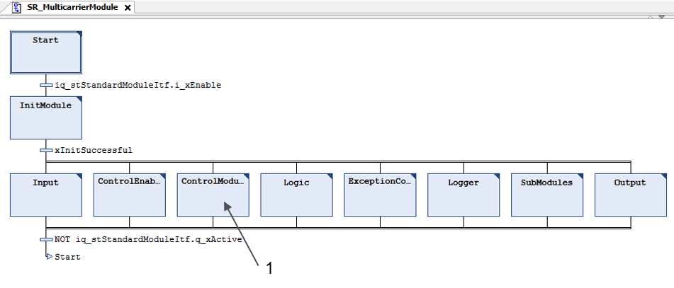
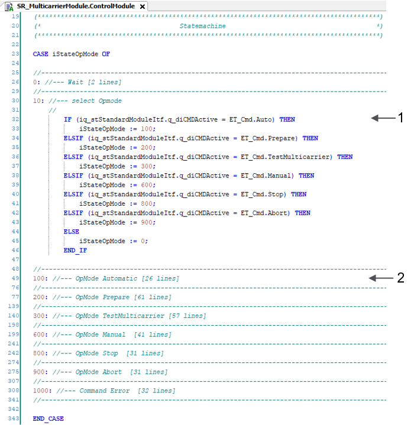
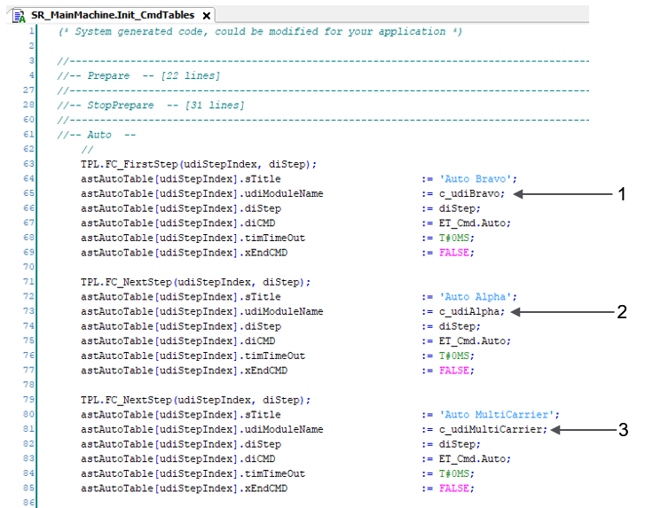

# Template Commands for FB\_Multicarrier

## Overview

The function block FB\_Multicarrier is not a standard template module. Therefore, the subroutine SR\_MulticarrierModule provides a state machine to provide the standard template command handling for this function block.

## Additional State Machine

In the action ControlModule, you find a state machine intended for applying the module commands to the function block FB\_Multicarrier.

| Item | Description |
| --- | --- |
| **1** | Additional state machine in the action ControlModule |

## ControlModule Action

The action ControlModule in the subroutine SR\_MulticarrierModule provides standard module commands as well as states for the handling of the commands for the function block FB\_Multicarrier.

| Item | Description |
| --- | --- |
| **1** | Module commands from SR\_MainMachine |
| **2** | For each module command, you find a separate state for handling the commands for the FB\_Multicarrier. |

## Module Commands

With the action ControlModule, you can send the module commands from the SR\_MainMachine to the SR\_MulticarrierModule like for any other equipment module from the template.

In the command table of SR\_MainMachine, the equipment module SR\_MulticarrierModule is used as any other standard equipment module.

The following graphic illustrates the example of the command `Auto` (Automatic) from the SR\_MainMachine.

| Item | Description |
| --- | --- |
| **1** | Command for SR\_BravoModule |
| **2** | Command for SR\_AlphaModule |
| **3** | Command for SR\_MulticarrierModule |

EIO0000004218.06