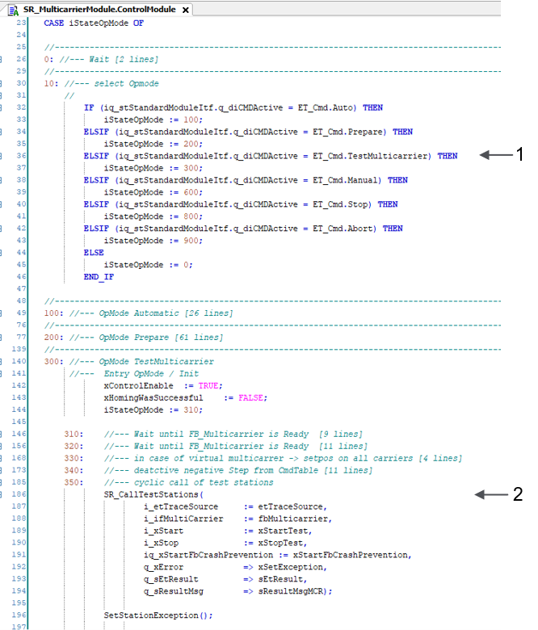
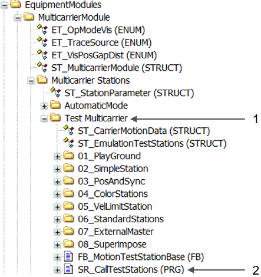

# TestMulticarrier

## Overview

In order to become familiar with the different functionalities of the Multicarrier and the MulticarrierStation libraries, the example project provides several application examples in the operation mode TestMulticarrier.

## Call of Test Stations

In the control module of the subroutine SR\_MulticarrierModule, the command for the operation mode TestMulticarrier is executed and cyclically calls the examples.

| Item | Description |
| --- | --- |
| **1** | Command for executing the test stations |
| **2** | Cyclic call of test stations |

The subfolder Test Multicarrier with the application examples is located in the folder EquipmentModules.

| Item | Description |
| --- | --- |
| **1** | Folder which includes the test examples |
| **2** | Program in which the example programs (test stations) are called |

EIO0000004218.06