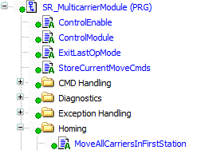
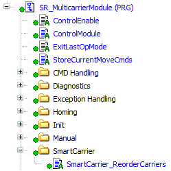

# Prepare Mode

## Overview

In the template operation mode Prepare, the carriers are moved into the first station and they are added to the first station in their order. If GVL\_Project.Gc\_xSmartCarrier is set to TRUE, the carriers are reordered.

The code example for the Prepare movement is found in the action MoveAllCarriersInFirstStation:  

The code example for reordering the carriers is found in the action SmartCarrier\_ReorderCarriers:  

The action MoveAllCarriersInFirstStation includes the following stages:

| Stage | Description |
| --- | --- |
| **1** | By calling the function MCR.FC\_OrderOfCarriersToTargetPosition, the order of the carriers in relation to the waiting position of the target station is read. |
| **2** | The configuration data for the products on the carriers are deleted. |
| **3** | The minimum gap between the carriers during movement is set. |
| **4** | The motion parameters for the movement of the carriers are set. |
| **5** | The carriers are sent to the first station with the move command MoveGapControl. |
| **6** | The carriers are added to the first station in their order. |
| **7** | Optionally, with the parameter GVL\_Project.Gc\_xSmartCarrier set to TRUE, you can reorder the carriers such that the Smart Carrier is in the proper position. |

EIO0000004218.06