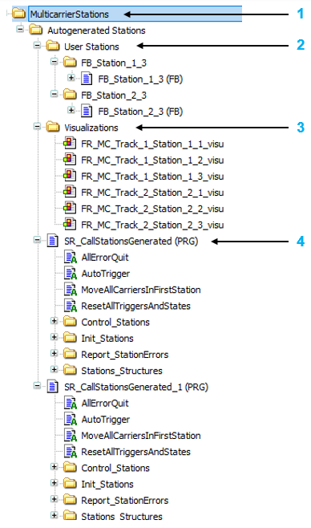
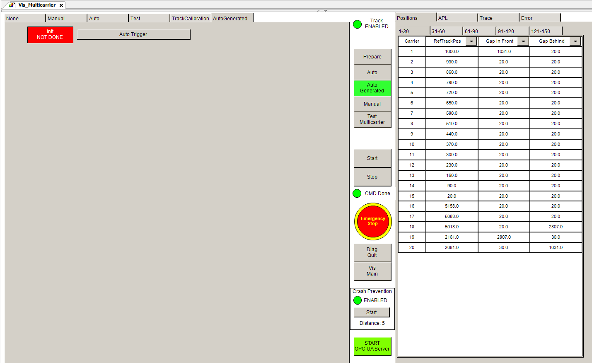
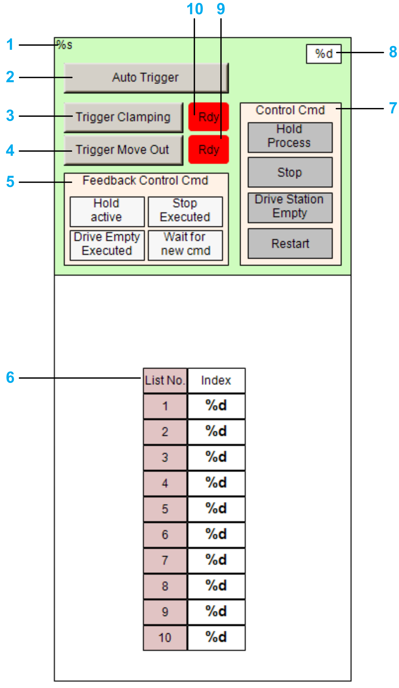

# AutoGenerated Mode

## Overview

The operation mode AutoGenerated allows the automatic generation of code for station types like clamping stations or declamping stations.

## Activating the AutoGenerated Mode

For using the AutoGenerated mode, execute the following steps in the Project Settings and in the Multicarrier Configuration editor (see [Lexium™ MC multi carrier Configuration Guide](../../../../../api/crossBook?lang=en-US&virtualBookName=MLSConfG&topicID=)):

| Step | Action |
| --- | --- |
| **1** | To activate the generation of stations, open the Project > Project Settings > Multicarrier Configuration Editor > Code Generation dialog box and activate the option Create Code For Stations.  For more information on the Project Settings, refer to the [Menu Commands Online Help](../../../../../api/crossBook?lang=en-US&virtualBookName=SoMMenu&topicID=TPC_MLS_Config_Tools_Options_D995A499). |
| **2** | In the Station Types tab of the Multicarrier Configuration editor, create a Station Type and select a Kind of station (for example Clamping Station). |
| **3** | In the Stations tab of the Multicarrier Configuration editor, create a station and edit the properties of the station. |
| **4** | In the Track tab of the Multicarrier Configuration editor, in the Commands area, select Update and perform the update command To Code. |

The stations code generated by the Multicarrier Configuration object is provided in the new MulticarrierStations folder in the Devices tree.

| Item | Description |
| --- | --- |
| **1** | Root folder of the generated station code. |
| **2** | Folder of user-defined stations.  NOTE: The code that you have added to this folder is kept when the station code is re-generated. |
| **3** | Visualization folder. |
| **4** | The main program of the generated station. The program (subroutine) is executed when you activate the AutoGenerated button in the Vis\_Multicarrier visualization.  NOTE: The code of the program is regenerated each time you update the code with the update command To Code in the Multicarrier Configuration editor. |

## Visualization in Vis\_Multicarrier

After generating the code, you can log into the controller and use the generated stations from the Vis\_Multicarrier visualization using the AutoGenerated mode. For more information on starting an operation mode within the visualization, refer to [Opening the Multicarrier Visualization](OpenMCVisu-2CA10E34.html)

NOTE: If you have not generated any station with the Multicarrier Configuration editor, the AutoGenerated mode is not selectable in the Vis\_Multicarrier visualization.

When the AutoGenerated mode is activated, the visualization displays the AutoGenerated frame with two elements:

* a message field indicating whether the initialization is ongoing (Init NOT DONE) or finished (Init DONE).
* the button AutoTrigger for starting the motion of the carriers according to the requirements of the individual stations.

## Visualization in MulticarrierStations Folder

The visualizations in the generated folder MulticarrierStations allow you to control the generated station(s): with the buttons, you can, for example, trigger the clamping or declamping or move the carriers out of the station.

The visualizations for different station types are designed similarly but provide different commands, depending on the type of station. The following example displays the visualization for a clamping station:

| Item | Description |
| --- | --- |
| **1** | Indicates the name of the station. |
| **2** | Button for activating the auto-triggering of the station. |
| **3** | Button for triggering the corresponding process (clamping, declamping, grouping). |
| **4** | Button for triggering the process that moves the carriers out of the station. |
| **5** | Indicates whether the corresponding control command for the station (see item 7) is activated or not. |
| **6** | Indicates the ordered list of carriers inside the station. |
| **7** | Buttons for triggering the corresponding control command. For more information on the options for controlling the processes at the station, refer to the methods HoldProcess, StopProcess, DriveProcessEmpty, and Restart of the interface IF\_ControlStandardStation in the [MulticarrierStation library](../../../../../api/crossBook?lang=en-US&virtualBookName=MCRSLib&topicID=CtrlGroupStation_EED16FBE). |
| **8** | Indicates the number of carriers in the station. |
| **9** | Indicates whether the moving out process can be triggered or not. |
| **10** | Indicates whether the corresponding process (clamping, declamping, grouping) can be triggered or not. |

EIO0000004218.06