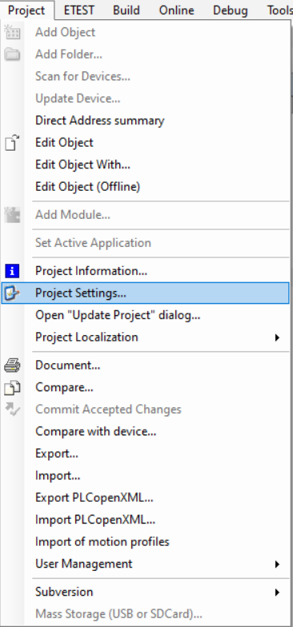
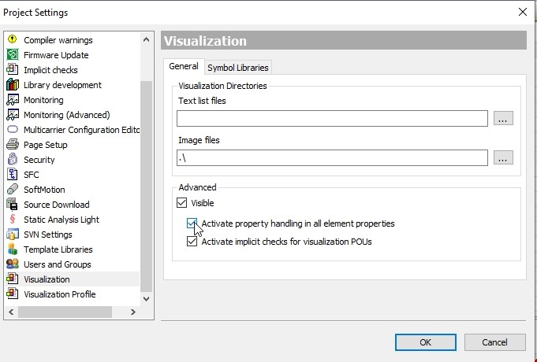

# Adding a Web Visualization

## Overview

When adding a web visualization (WebVisu) to the Visualization Manager of the Multicarrier example project, go to Project > Project Settings > Visualization and activate the check box Activate property handling in all element properties.

 

For more information on the Project Settings, refer to the [Menu Commands Online Help](../../../../../api/crossBook?lang=en-US&virtualBookName=SoMMenu&topicID=D_SE_0083960).

EIO0000004218.06