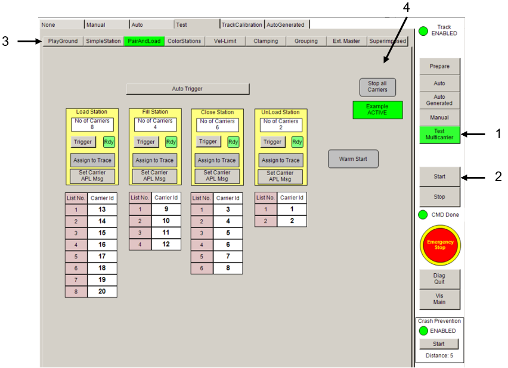

# Running the Test Stations

## Overview

When you have started the Multicarrier visualization (see [Opening the Multicarrier Visualization](OpenMCVisu-2CA10E34.html#OpenMCVisu-2CA10E34)), you can access the visualization of the different application examples (test stations).  

| Item | Description |
| --- | --- |
| **1** | Button for selecting the operation mode TestMulticarrier  in order to be able to call the test stations. |
| **2** | Button for starting the selected operation mode. |
| **3** | Tabs for selecting the different station examples. |
| **4** | Buttons for starting and stopping the selected station example. |

EIO0000004218.06