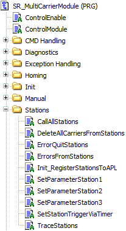

# Executing a Station

## Overview

For executing the stations, a number of actions are provided, for example for error handling or for the registration to the Application Logger.

In the folder Stations, you find the actions that you must modify when adding a new station:

| Action | Description |
| --- | --- |
| CallAllStations | With this action, you can add the cyclic call of the additional stations and the parametrization action SetParameterStationX for the corresponding station, for example SetParameterStation1. |
| DeleteAllCarriersFromStations | When leaving the automatic mode or in case of an error, a cold start is necessary. This means that the carriers must move to the first station and must be added to the first station. As a carrier can only be assigned to one station, all stations have to release the carriers assigned to them. |
| ErrorQuitStations | With this action, you call the error quit of the stations. |
| ErrorsFromStations | With this action, you detect station errors and activate the exception handling. For more information, refer to [Exception Handling](ExceptHandl-2DA91519.html#ExceptHandl-2DA91519). |
| Init\_RegisterStationsToAPL | In order to read messages from your station in the Application Logger, the station must be registered to the Application Logger. In the example project, the registration mechanism is inherited from the FB\_CoreStation so that you only need to activate the registration. Additionally, you can choose a specific name for your station which will be used by the Application Logger. |
| SetParameterStation1 | This action must be copied and renamed. The parameters of the action must be adapted to your specific station. |
| SetStationTriggerViaTimer | This action sets time-dependent triggers for the different stations to move the carriers out of the station. For each station, an individual timer can be set. |
| TraceStations | Add the new station so that you can assign carriers that are sent out. For more information on tracing the carriers of a station, refer to [Trace](Trace-2FA11F93.html#Trace-2FA11F93). |

NOTE: For visualizing the state of a newly added station, the visualization Vis\_StationCopyMaster is available as a copy master.

1. Search for Station1 in the master.
2. Replace Station1 with the name of your station.   
   **Result:** The visualization objects are added to the visualization Vis\_Auto.

EIO0000004218.06