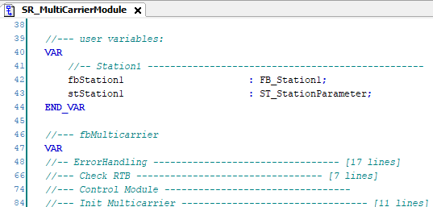

# Instancing a Station

## Overview

The instance variables for Station 1 can be found in the subroutine SR\_MulticarrierModule in the first local variable declaration. Additionally, a structure with station parameters (ST\_StationParameter) is provided and can be modified as required.

Additional stations can be instanced here.

EIO0000004218.06