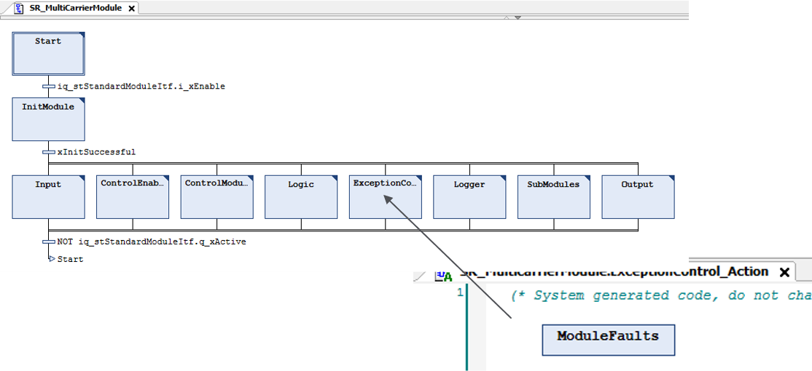
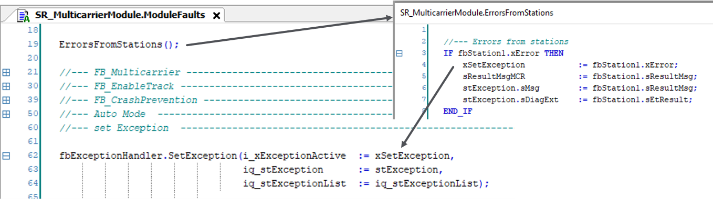
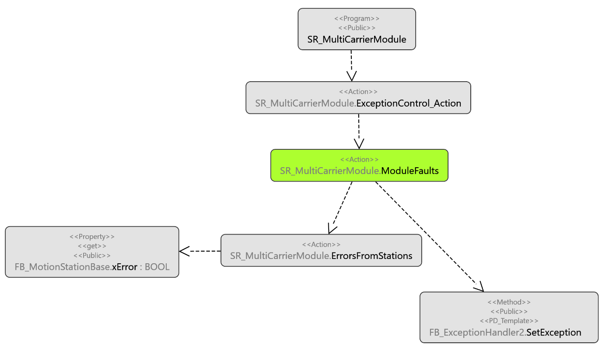

# Exception Handling in Template

## Overview

In the action ModuleFaults within the step ExceptionControl, the errors detected by the station are called and mapped to the exception handling of the template.

## Call of Exception Action

Call of the exception action ModuleFaults within ExceptionControl:

## SetException Method

In ModuleFaults, the errors detected by the station are mapped to the exception handling of the template by executing the method SetException from the template function block FB\_ExceptionHandler:

## Call Flow

Overview of the call flow:

EIO0000004218.06