# Trace – General Information

## Overview

The example project provides a mechanism for tracing a number of carriers at a time: With the array aifTraceObject, you can hand over the carriers that you want to trace.

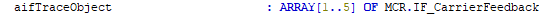

The carriers to be traced can be selected manually via the visualization or they can be assigned via a station.

## Carrier Selection via Visualization

The action TraceAndAPL (in the folder Diagnostics) includes the assignment of the selected carriers to the array of the trace object. For selecting the corresponding carriers, the variables udiTraceObject1, udiTraceObject2, etc., are used.

In the visualization Vis\_Multicarrier, the carrier indexes can be assigned to trace objects. In the following example, carrier 3 is assigned to trace object 1:

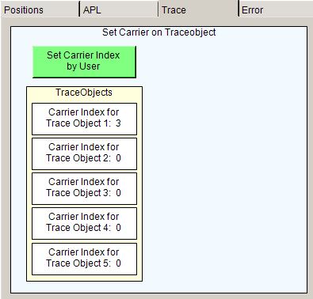

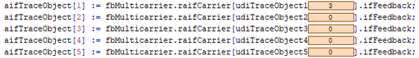

In the folder Traces, you find pre-defined trace objects:

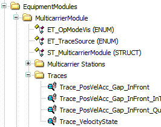

When you open, for example, the trace Trace\_PosVelAcc\_Gap\_InFront after having assigned carrier 3 to trace object 1, the variables Position, Velocity, Acceleration and GapToCarrierInFront are traced for carrier 3:

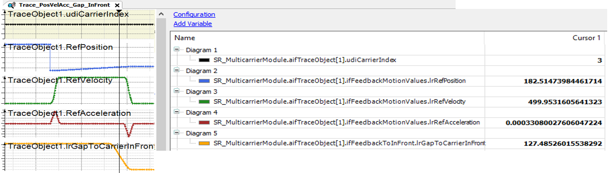

## Writing Trace Object from Station

In addition to manually setting the carriers to be traced, you can have a station assign the carriers to the trace. The tracing is performed for the carriers that are leaving the station.

For the station-based tracing of carriers, the example project provides the program SR\_CarriersInStationToTrace:

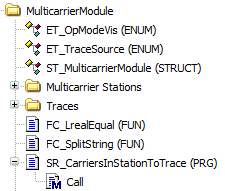

The method Call provides two inputs:

| Input | Description |
| --- | --- |
| i\_xTrigger | This must be the same trigger as the trigger used for the station when carriers are sent out. |
| i\_ifStation | Assigns the station that should write to the trace. |

The method SR\_CarriersInStationToTrace.Call must be called before calling the station:

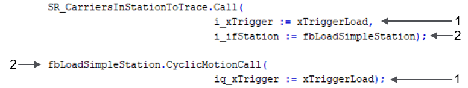

| Item | Description |
| --- | --- |
| **1** | Trigger variable for the execution of the carrier movement |
| **2** | Station function block |

Only one station at a time can write to the trace. Therefore, the example project provides the enumeration ET\_TraceSource. For user-defined stations, the name of the enumeration can be modified.

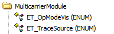

When using the enumeration ET\_TraceSource, set an IF condition before calling the method SR\_CarrierInStationToTrace.Call:

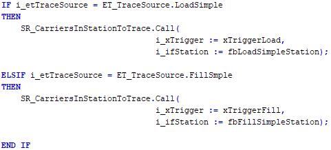

In the test station examples, you can select the trace source via the visualization: Click the button Assign to Trace for example for the Load Station within the PosAndSync display:

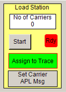

The selected station is also displayed in the Trace visualization:

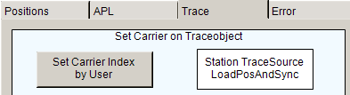

EIO0000004218.06