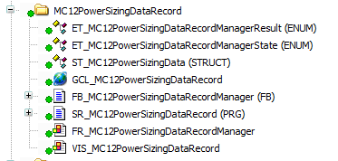
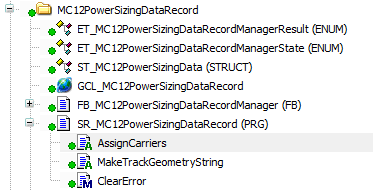
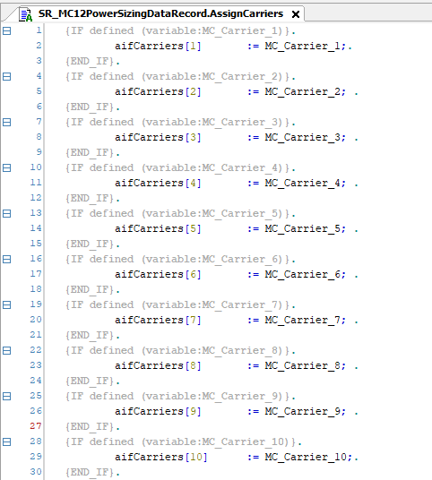

# Preconditions for Data Recording for the Power Sizer

## Overview

MC12PowerSizingDataRecord enables the creation of a trace file containing the motion data of the carriers in a Lexium™ MC multi carrier track. The generated trace file can be imported into the MC12 Power Sizer of EcoStruxure Machine Expert Twin, where it can be used to evaluate and size the power consumption of a multi‑carrier track system. (For more information, refer to the [EcoStruxure Machine Expert Twin Getting Started User Guide](https://product-help.se.com/Machine%20Expert%20Twin/latest/en-US/Tw_GetSt?t=Tw_GetSt%2FFMIMenu-E01D9C39.html).)

The example folder MC12PowerSizingDataRecord contains a visualization and the code items required for recording the data of one or several Lexium™ MC multi carrier tracks and saving the data in a *\*.csv* file. The MC12 Power Sizer tool in EcoStruxure Machine Expert Twin processes the *\*.csv* file and allows you to calculate the number of power supplies and power groups required.



## Installation of EcoStruxure Machine Expert Twin

The EcoStruxure Machine Expert Twin must be installed using the Schneider Electric Software Installer. (For more information, refer to the [Schneider Electric Software Installer User Guide](../../../../../api/crossBook?lang=en-US&virtualBookName=Installer&topicID=).)

## Sufficient Controller Memory

The subroutine SR\_MC12PowerSizingDataRecord writes a file on the flashcard of the controller. The flashcard must have sufficient free memory to save the file. For more information on the file size, refer to [Data Recording for the Power Sizer](RunningPowerSizer-5382F6D4.html#RunningPowerSizer-5382F6D4).

## Modifications for Multiple Lexium™ MC multi carrier Tracks

If you have modified the configuration of the example and use several Lexium™ MC multi carrier tracks, you have to adapt the program accordingly.

NOTE: You can only record the data for one Lexium™ MC multi carrier track at a time.

Before starting the recording, you must verify the action AssignCarriers and modify the action MakeTrackGeometryString in the subroutine SR\_MC12PowerSizingDataRecord.



In the action AssignCarriers, verify that the correct carriers are assigned to the parameter aifCarriers.



In the action MakeTrackGeometryString, insert the index of the track for which you want to record the data.

Example for the first Lexium™ MC multi carrier track:

```
sGeometry := '';
FOR udiLoop := 1 TO GVL_MulticarrierConfiguration.Gc_astTracks[1].udiNumberOfSegments
DO
    IF
GVL_MulticarrierConfiguration.Gc_astSegmentTypes[GVL_MulticarrierConfiguration.Gc_astTracks[1].astSegments[udiLoop].diSegmentTypesIndex].xIsCurved
    THEN
        sGeometry := concat(sGeometry ,'C');
    ELSE
        sGeometry := concat(sGeometry,'S');
    END_IF
END_FOR
```

Example for the second Lexium™ MC multi carrier track:

```
sGeometry := '';
FOR udiLoop := 1 TO GVL_MulticarrierConfiguration.Gc_astTracks[2].udiNumberOfSegments
DO
    IF
GVL_MulticarrierConfiguration.Gc_astSegmentTypes[GVL_MulticarrierConfiguration.Gc_astTracks[2].astSegments[udiLoop].diSegmentTypesIndex].xIsCurved
    THEN
        sGeometry := concat(sGeometry ,'C');
    ELSE
        sGeometry := concat(sGeometry,'S');
    END_IF
END_FOR
```

EIO0000004218.06